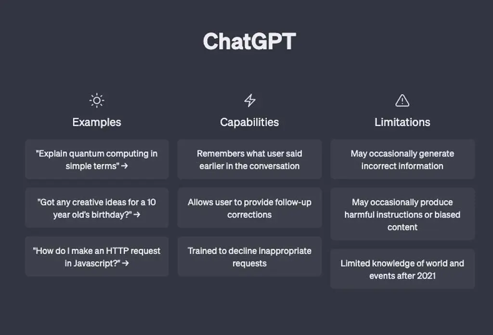
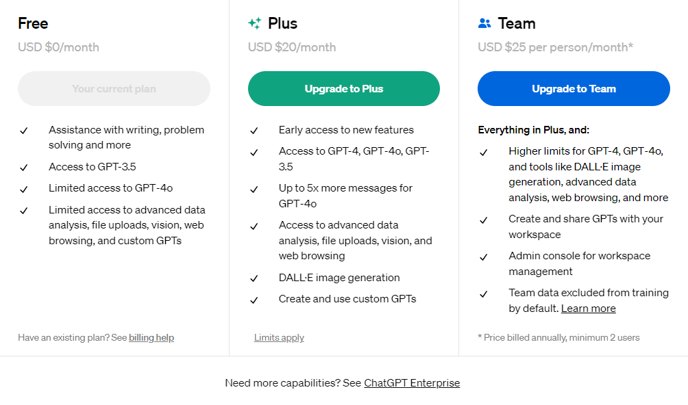

## **ChatGPT** ##
***

ChatGPT is constantly evolving and can be used to create conversational tones, answer frequently asked questions, and even draft technical articles. GPT, also known as Generative Pre-trained Transformer, is a language model that employs deep learning techniques to produce natural text. In addition to text, it can generate code, stories, poems, and much more. These distinguishing features have made GPT an important subject in **Natural Language Processing (NLP)**.

In May 2024, OpenAI announced GPT-4, their flagship model that can reason across audio, vision, and text in real time, as described in the article 'Hello GPT-4' “GPT-4o (“o” for “omni”) is a step towards much more natural human-computer interaction—it accepts as input any combination of text, audio, image, and video and generates any combination of text, audio, and image outputs. It can respond to audio inputs in as little as 232 milliseconds, with an average of 320 milliseconds, which is similar to human response time in a conversation. It matches GPT-4 Turbo performance on text in English and code, with significant improvement on text in non-English languages, while also being much faster and 50% cheaper in the API. GPT-4o is especially better at vision and audio understanding compared to existing models”.

Regarding personal use, work assignments, and other requirements, the conventions that ChatGPT-4o offers are valuable attributes that enhance its application.

### Features: ###
- Multimodal capabilities for generating and interpreting various types of content.
-	Advanced content generation, including text, images, and possibly other modalities.
-	Document editor functionality for editing and refining generated content.
-	Rewriting feature for transforming text into different styles or formats.
-	Chat option for interactive conversations with ChatGPT.
-	AI Art Generator powered by DALL-E for creating artwork based on user input.
-	Visual context analysis to understand and interpret visual content.
-	Text-to-Speech (TTS) functionality for converting text into spoken audio.
-	Versatility in handling diverse tasks and inputs.
-	Multilingual support for interacting in multiple languages.
-	Exporting ChatGPT history, including text conversations and possibly other data.
-	Customizability options for tailoring ChatGPT to specific user preferences and needs.
-	Task automation capabilities to streamline repetitive tasks.
-	Robust security measures to protect user data and privacy.
-	Interactive feedback during interactions with ChatGPT for user guidance and improvement.
-	Coding assistance for developers and programmers.
-	API access for integrating ChatGPT into third-party applications and services.
-	Emotional intelligence for understanding and responding appropriately to user emotions expressed in text.
-	Detailed report generation for providing insights into ChatGPT usage and performance.
-	Custom workflow creation for designing personalized workflows and processes.
-	Scenario planning features for simulating and exploring various scenarios.

### Plans ###

ChatGPT offers a variety of plans to suit different user requirements:

1.	Free Plan:
-	Provides fundamental writing assistance, access to GPT-3.5 and limited access to ChatGPT-4o, and some additional functionalities. Recommended for those needing assistance with basic writing tasks.
2.	Plus Plan:
-	Available at $20 per month. Offers more specific benefits, including early access to new features, broader access to GPT models, advanced data analysis, and DALL-E image generation. Recommended for users seeking an enhanced writing experience.
3.	Team Plan:
-	Priced at $25 per user per month. Applies to individuals with monthly wages of up to $300. Includes all features available in the Plus plan, along with increased usage allowances, collaborative workspace, and administrative functionalities. Designed to enhance professionalism and communication effectiveness for teams and organizations.

