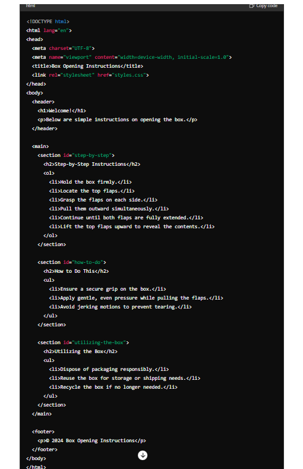
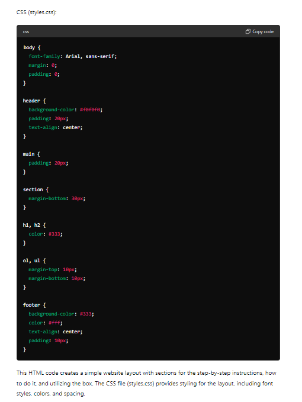
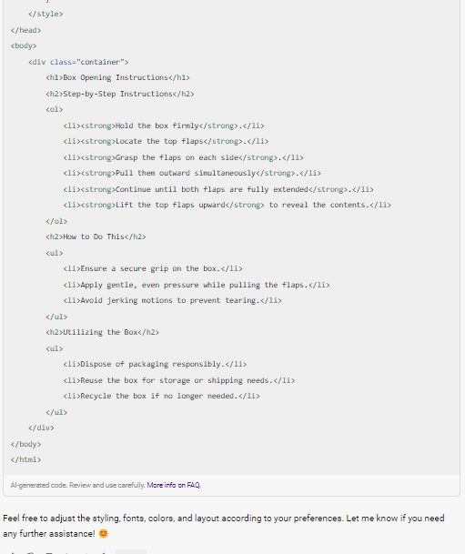
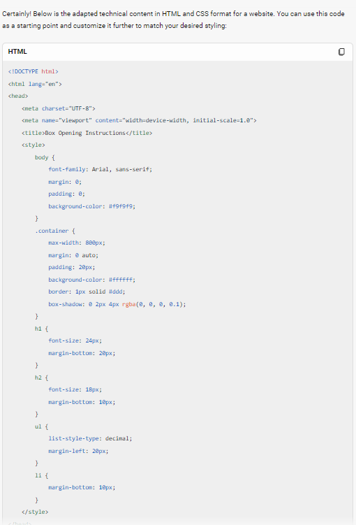
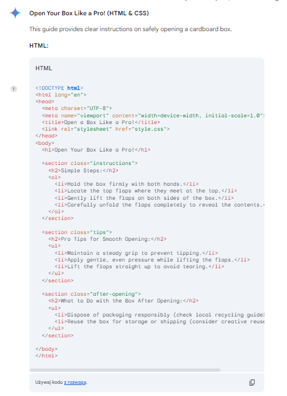
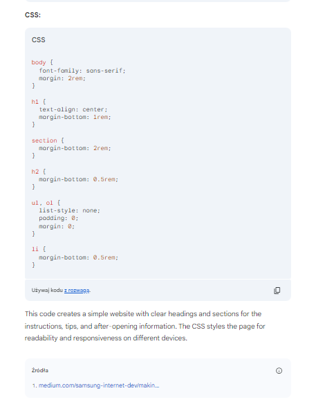

## **Code Generation** ##
***

GenAI, depending on the model (as we have already confirmed when attempting to generate output in Markdown), can help us create code. However, it is important to be cautious and mindful of legal and ethical issues. Let us see how GenAI handles generating code in HTML and CSS.

### Example ###
```
<GOAL_AND_PERSONA> 
    <PERSONA/AUTHOR> 
        Act as a seasoned technical writer who needs to publish their documentation online
    </PERSONA/AUTHOR> 
    <GOAL>
        Adapt the provided technical content into a website format.
    </GOAL>
    <PERSONA/AUDIENCE> 
        Your audience consists of individuals seeking instructions on opening a box, accessible via a website.
    </PERSONA/AUDIENCE> 
</GOAL_AND_PERSONA> 
<INSTRUCTIONS> 
    To complete the task:
    1. **Transform Content into Website Format:** Adapt the provided instructions into a website layout, ensuring it is visually appealing and user-friendly.
    2. **Structure Step-by-Step Instructions:** Organize the step-by-step instructions in a clear and intuitive manner, using appropriate formatting and styling.
    3. **Enhance Readability:** Utilize HTML and CSS to enhance readability and user experience, incorporating features such as headings, bullet points, and appropriate spacing.
    4. **Implement Responsive Design:** Ensure that the website format is responsive and accessible across various devices, including desktops, tablets, and smartphones.
</INSTRUCTIONS> 
<CONTEXT> 
    Provided Content: 
    Welcome! Below are simple instructions on opening the box.
    ### Step-by-Step Instructions
    1. **Hold the box firmly**.
    2. **Locate the top flaps**.
    3. **Grasp the flaps on each side**.
    4. **Pull them outward simultaneously**.
    5. **Continue until both flaps are fully extended**.
    6. **Lift the top flaps upward** to reveal the contents.
    ### How to Do This
    - Ensure a secure grip on the box.
    - Apply gentle, even pressure while pulling the flaps.
    - Avoid jerking motions to prevent tearing.
    ### Utilizing the Box
    - Dispose of packaging responsibly.
    - Reuse the box for storage or shipping needs.
    - Recycle the box if no longer needed.
    ---
</CONTEXT> 
<TONE>
    Maintain a professional and user-friendly tone throughout the website adaptation process.
</TONE>
<COMMAND>
    Transform the provided technical content into a visually appealing and user-friendly website format, ensuring optimal readability and accessibility.
</COMMAND>
<SPECIFICATIONS>
    Ensure that the website format adheres to HTML and CSS standards, incorporates responsive design principles, and offers a seamless user experience across various devices.
</SPECIFICATIONS>
<RECAP> 
    Remember to prioritize usability and readability in the website adaptation, providing a clear and intuitive interface for users.
</RECAP>
```

### Effect ###

**ChatGPT**




**Copilot**




**Gemini**




All three models successfully generated code for a web page in HTML and CSS. However, Copilot placed the CSS code inside the HTML code. The codes are generated correctly.

The web page generated by ChatGPT is a simple classic website. You can it here: [ChatGPT code for a website](https://kinrap.github.io/ChatGPT/).

The web page whose code was generated by Copilot is also a simple version of the page. It is available at [Copilot code for a website](https://kinrap.github.io/Copilot/).

The website whose code was generated by Gemini also features simplicity and is available at [Gemini code for a website](https://kinrap.github.io/Gemini/).

Of course, all pages can be customized and tailored to individual needs. As you can see, the codes were generated correctly, and the pages are functioning, demonstrating that AI like Gemini can assist technical writers in this field. However, depending on the tool, AI may not support us in every programming language.
