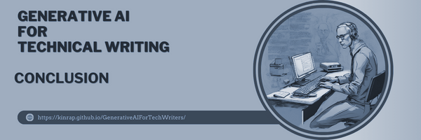

# **Conclusion** #
***

The conclusion chapter is a crucial part of any research, as it provides a summary of the main findings and insights discussed throughout the document. In this chapter, we will delve into an important topic that concerns technical writers: the use or non-use of GenAI. This subject has sparked numerous debates and discussions within the technical writing community, and it is crucial to explore both sides of the argument. By examining the potential benefits and drawbacks of incorporating AI into the technical writing process, we can gain a deeper understanding of its impact on our profession.

Another subchapter that awaits us in this conclusion chapter revolves around a pressing question: does GenAI pose a risk to technical writers? This query has raised concerns among many professionals in the field, as they fear that their roles may be threatened by advancements in artificial intelligence. However, it is essential to approach this topic with an open mind and consider various perspectives. By doing so, we can uncover the reasons why AI may not pose a significant risk to technical writers.

As we embark on this concluding chapter, I encourage you to keep an open mind and explore the intricacies of these important topics. By examining the use or non-use of AI by technical writers and considering why AI may not pose a significant threat to our profession, we can gain valuable insights that shape the future of technical writing.
