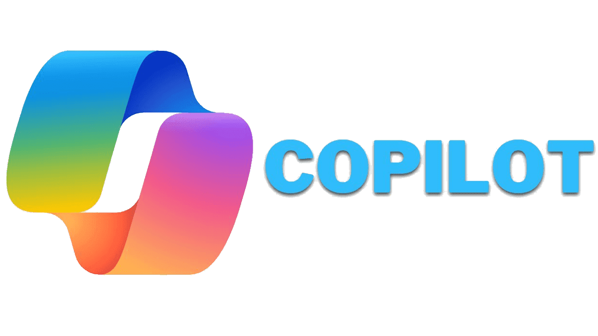
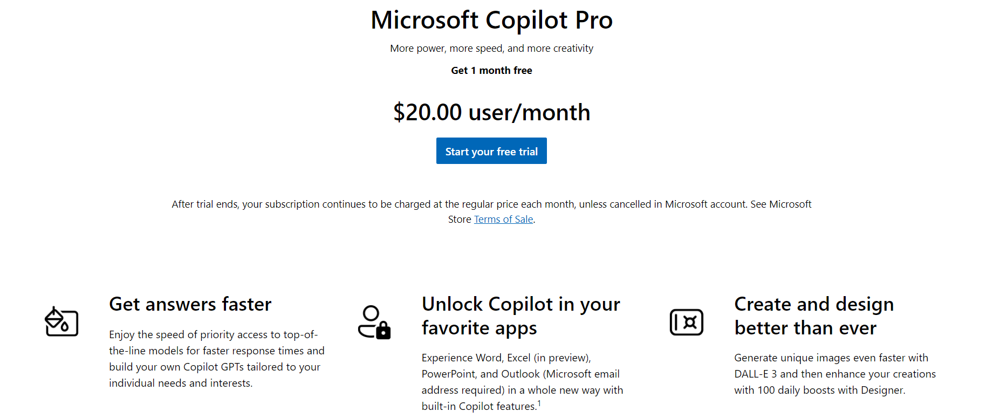
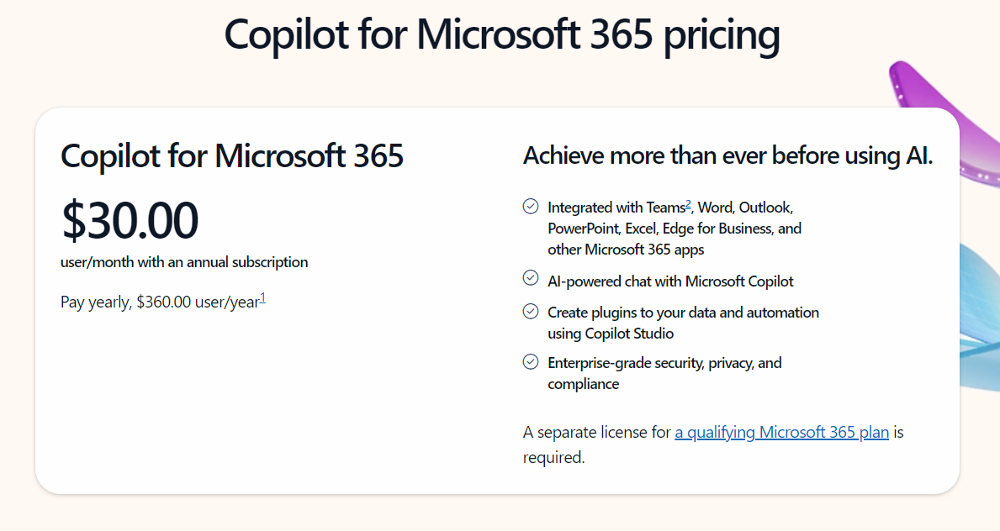

## **Copilot** ##

Copilot is an AI software addition designed by Microsoft. It is a conversational chat interface that allows users to search for specific information, write emails, summarize content, and generate images from text prompts.

Copilot relies on AI, Bing's vast web-scraping database**Natural Language Processing (NLP)**, **Text to Speech (TTS)** for creating natural speech responses, **Retrieval-Augmented Generation (RAG)** for grounding and contextualizing responses, and **Azure Cloud** services.

A unique feature of Copilot in Windows is its ability to perform administrative operations, such as changing the color mode to dark, adjusting the volume, or enabling Do Not Disturb mode. It can also summarize or dictate text selected on your Windows desktop.

With a paid subscription, you can utilize Copilot in Microsoft 365 apps.

For developers, Copilot offers code suggestions, autocompletes code, and provides contextual recommendations. It is compatible with most built-in development tools and various programming languages.

### Features: ###

-	Code Autocompletion Copilot suggests relevant code snippets, function calls, and variable names as you type, making it faster to write code.
-	Context-Aware Suggestions: It understands the context of your code and provides more accurate suggestions based on the surrounding code, comments, and variable names.
-	Multi-Language Support: Copilot works with various programming languages, including Python, JavaScript, Java, C++, and more.
-	Documentation Integration: It fetches relevant documentation for functions, libraries, and APIs, helping you understand how to use them effectively.
-	Code generation for entire functions, classes, or blocks of code based on natural language descriptions or comments.
-	Programming pairing by collaborating to write code, catch errors, and improve code quality.
-	Customizable snippets.
-	Rewriting and tone enhancement by suggesting ways to strengthen arguments, smooth out inconsistencies, and rewrite text.
-	Integration of content from all sources where text is stored and created.
-	Summarizing of lengthy documents or web pages.
-	Image Creation in Designer.
-	Use of Plugins and Custom GPTs.

### Plan ###
Microsoft Copilot offers a freemium pricing model, with a free trial and paid subscriptions like [Pro](https://www.microsoft.com/en-us/store/b/copilotpro) and [365](https://www.microsoft.com/en-us/microsoft-365/enterprise/copilot-for-microsoft-365):

1.	**Free Trial**:
-	Primarily for trying out Copilot and basic use cases. It can be used in the free web versions of Word, Excel, PowerPoint, OneNote, and Outlook (requires a Microsoft email address).
2.	**Microsoft Copilot Pro**:
-	Available at $20 per user per month. This plan integrates Copilot with the Microsoft 365 suite, offering more advanced features for content creation and editing within the full desktop applications. 
3.	**Copilot for Microsoft 365**:
-	Available at $30 per month per user. This plan is dedicated for business clients and education. It integrates Copilot with the Microsoft 365 suite, offering more advanced features for content creation and editing within the full desktop applications. Teams-integrated features require a Teams license.
