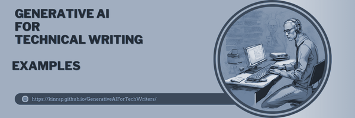
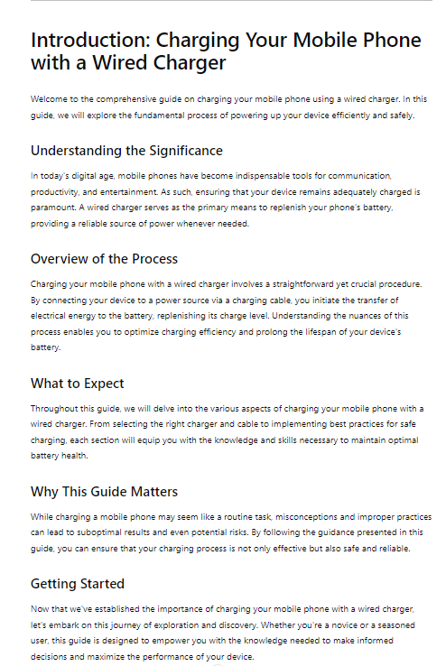
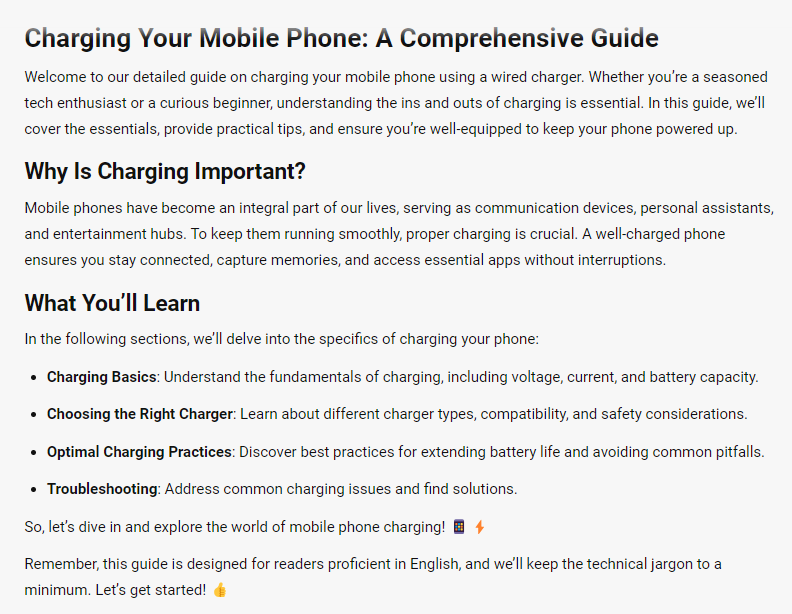
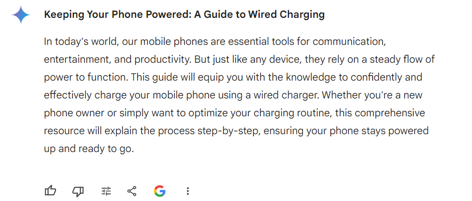

## **Introduction** ##
***

The introduction sets the stage for your entire work. It is the first element of the documentation that the reader encounters and can influence their perception and reception of it. Therefore, writing it in an engaging yet specific manner is crucial. The introduction establishes the tone and outlines the context for the entire documentation. This is where GenAI can help. It ensures that your document starts with clarity, focus, and a hook that engages your readers right from the beginning. Let us see how effectively GenAI can assist us in generating an introduction that meets these expectations.

### Example ###

```
<GOAL_AND_PERSONA> 
[PERSONA/AUTHOR] 
You are a technical writer.
[GOAL]
Your task is to prepare a draft introduction for a guide on charging a mobile phone using a wired charger.  
[PERSONA/AUDIENCE] 
User from Poland who is proficient in English.
</GOAL_AND_PERSONA> 
<INSTRUCTIONS> 
The introduction should provide a comprehensive overview and set the context. 
The introduction should capture the essence of the subject matter, outline its significance, and prepare the reader for the in-depth exploration that follows
 </INSTRUCTIONS> 
CONSTRAINTS> 
Don’t use jargon and jokes. 
</CONSTRAINTS> 
<CONTEXT> 
Ensure the content is well-researched and aligns with industry standards for technical documentation.
</CONTEXT> 
<TONE>
Use a professional tone
</TONE>
<COMMAND>
Write clear introduction.
</COMMAND>
<SPECIFICATIONS>
 Use short sentences. 
</SPECIFICATIONS>
```

### Effects ###

**ChatGPT**



**Copilot**



**Gemini**



Two first tools managed quite well with this task. Although it seemed quite simple, there may be reservations especially regarding Gemini's response. It completely failed to meet the requirements of technical documentation. On the other hand, Copilot used emoticons, although they should not really appear in technical documentation.

