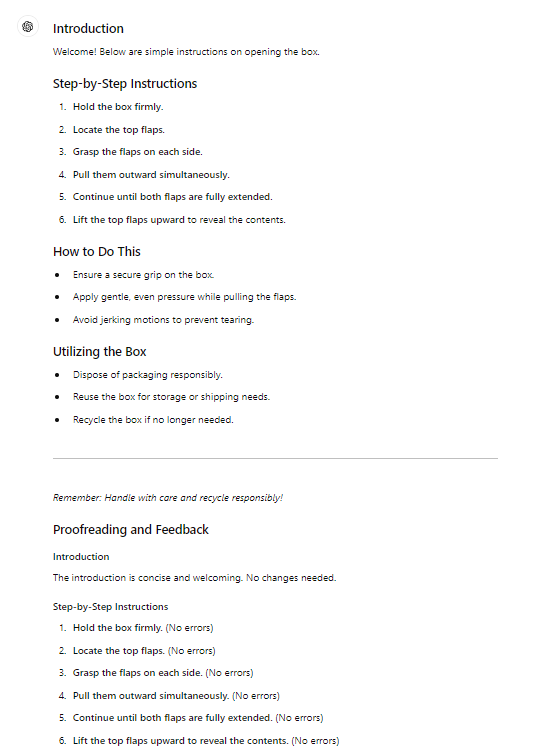
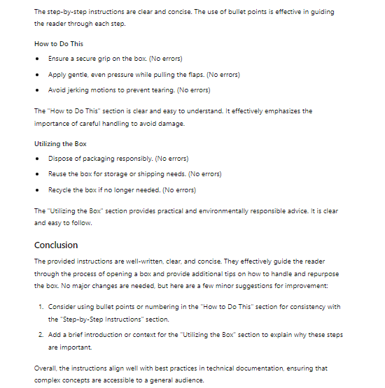
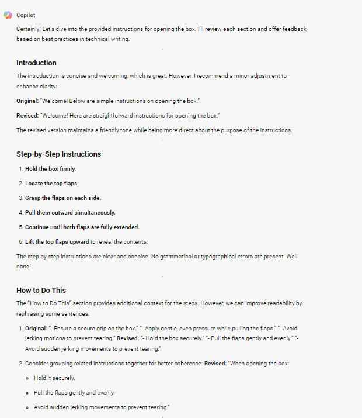
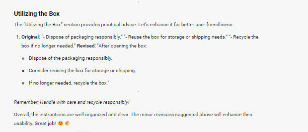
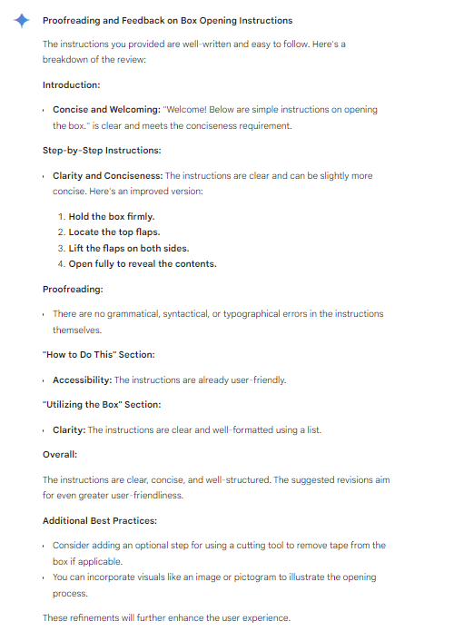

## **Get Feedback** ##
***

After drafting your piece, it is essential to verify that it meets the required standards. Utilizing GenAI, you can promptly assess your technical content for both user-friendliness and technical accuracy. To verify this, we will use the already created documentation on how to open the box.

### Example ###

```
<GOAL_AND_PERSONA> 
[PERSONA/AUTHOR] 
You are a seasoned technical writer with an eye for detail and clarity.
[GOAL]
Thoroughly proofread the provided instruction to identify and correct any grammatical, syntactical, or typographical errors: 
"Instrution:
### Introduction

Welcome! Below are simple instructions on opening the box.

### Step-by-Step Instructions

1. **Hold the box firmly**.
2. **Locate the top flaps**.
3. **Grasp the flaps on each side**.
4. **Pull them outward simultaneously**.
5. **Continue until both flaps are fully extended**.
6. **Lift the top flaps upward** to reveal the contents.

### How to Do This

- Ensure a secure grip on the box.
- Apply gentle, even pressure while pulling the flaps.
- Avoid jerking motions to prevent tearing.

### Utilizing the Box

- Dispose of packaging responsibly.
- Reuse the box for storage or shipping needs.
- Recycle the box if no longer needed.

---

*Remember: Handle with care and recycle responsibly! *"

[PERSONA/AUDIENCE] 
Author of this Instruction
</GOAL_AND_PERSONA> 
<INSTRUCTIONS> 
To complete the task:
    1. **Review Introduction:** Ensure that the introduction is concise and welcoming, adhering to the specified constraints.
    2. **Proofread Step-by-Step Instructions:** Check for any errors and recommend improvements for clarity, coherence, conciseness,and correct any grammatical, syntactical, or typographical errors.
    3. **Evaluate "How to Do This" Section:** Ensure that technical concepts are accessible to a general audience, suggesting potential rewrites or reorganization for better readability.
    4. **Assess "Utilizing the Box" Section:** Review for clarity and recommend improvements for user-friendly presentation.
 </INSTRUCTIONS> 
<CONTEXT> 
Text of Instruction: 
### Introduction
Welcome! Below are simple instructions on opening the box.
### Step-by-Step Instructions
1. **Hold the box firmly**.
2. **Locate the top flaps**.
3. **Grasp the flaps on each side**.
4. **Pull them outward simultaneously**.
5. **Continue until both flaps are fully extended**.
6. **Lift the top flaps upward** to reveal the contents.
### How to Do This
- Ensure a secure grip on the box.
- Apply gentle, even pressure while pulling the flaps.
- Avoid jerking motions to prevent tearing.
### Utilizing the Box
- Dispose of packaging responsibly.
- Reuse the box for storage or shipping needs.
- Recycle the box if no longer needed.
---
*Remember: Handle with care and recycle responsibly! *"
</CONTEXT> 
<TONE>
Maintain a professional and understanding tone throughout the review process. 
</TONE>
<COMMAND>
Thoroughly proofread and provide feedback on the clarity, coherence, and conciseness of the provided instructions for opening the box.
</COMMAND>
<SPECIFICATIONS>
Ensure that the feedback aligns with best practices in technical documentation and offers actionable recommendations for enhancement.
</SPECIFICATIONS>
<RECAP> 
Remember to provide constructive feedback to enhance the clarity and usability of the instructions.
</RECAP>
```

### Effect ###

**ChatGPT**




**Copilot**




**Gemini**



All GenAI models provided the correct response to the prompt. The review and feedback given by ChatGPT are very precise, addressing each section of the document and even individual sentences with comments like ```(No errors)```. ChatGPT did not make any corrections because it found none were needed, but it did provide suggestions for improving the document.