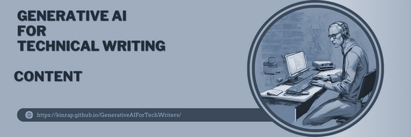

### **Generation** ###
***

Let's begin with the text generation capabilities of generative AI. At the core of generative AI's text generation are advanced AI-powered **Large Language Models (LLMs)**. LLMs are trained on extensive datasets and can generate human-like text in various contexts. These models learn patterns and structures within the data to produce coherent and contextually relevant responses. They can generate text, engage in conversation, provide explanations, summaries, and more. 

#### **Drafting** ####

Drafting documentation using AI involves several key processes. First, AI can analyze inputs such as product specifications, user stories, code comments, and design documents to create initial drafts of technical documents. For example, an AI tool can take a set of API endpoints and automatically generate basic documentation for each endpoint, including descriptions, parameters, and example requests and responses. Additionally, AI can use predefined templates to structure the generated content, ensuring consistency across different documents by filling in the relevant information according to the required standard format. 

**Natural Language Generation (NLG)** algorithms further enhance this process by converting structured data into human-readable text, which is particularly useful for generating repetitive or data-intensive sections of documentation, such as changelogs, feature lists, or performance reports. 
Guided by appropriate instruction, can aid in content organization, generation, and polishing content, creating a collaborative process that improves effectiveness. However, the emotional depth, intricate craftsmanship, and human touch are indispensable. 

#### **Summarizing**  ####
AI also excels at summarizing information. Through extractive summarization, AI can scan through large volumes of technical information and extract key points, aiding in the creation of concise summaries. This approach is useful for executive summaries, quick start guides, or highlighting important updates in release notes. By identifying the most critical sections of a document, AI helps writers focus on essential information that needs to be included in the summary or overview. Abstractive summarization takes this a step further by rephrasing and condensing the content while maintaining the original meaning in a more concise form. This is especially useful for creating high-level overviews from detailed technical reports.

#### **API** ####
In practical applications, generative AI significantly enhances API documentation by analyzing the API schema to generate descriptions for endpoints, parameters, and data models. For instance, if an API has an endpoint for retrieving user information, AI can generate a description such as "This endpoint retrieves detailed information about a specific user based on their user ID." Furthermore, AI can provide example code snippets for using the API in different programming languages, helping developers understand how to implement it in their projects.

#### **User manuals and guides** ####
For user manuals and guides, AI can create detailed step-by-step instructions for using a product or feature. For example, for a new software feature, AI can generate a guide that walks users through the setup process, configuration options, and common troubleshooting steps. AI can also compile a list of frequently asked questions and recurring technical issues issues based on user queries and support tickets, creating a comprehensive help section that addresses the most common user concerns.

#### **Release Notes and Changelogs** ####
When it comes to release notes and changelogs, AI can track changes in the codebase and compile release notes that highlight new features, bug fixes, and improvements. 

### Images and Videos ###

Thank to GenAI such algorithms can be generative in the sense that they have the capability to generate new and original content of images, videos, or text that is hardly distinguishable from humans. This can be seen as very helpful.

--- 

Using generative AI, you can produce documentation much faster, as available tools can create sample text with just a few simple prompts. Once a technical writer learns to effectively use generative AI, building an initial document becomes significantly quicker than manually assembling the text. Additionally, using generative AI to proofread and optimize documents saves a lot of time, as these processes can be automated.

While generative AI is not yet ready to create comprehensive technical content, especially considering the limitations of its training data and data privacy concerns, the human touch remains essential. Even though AI can't write complete articles for you, it can help uncover ideas and topics that you might not have thought of on your own.
