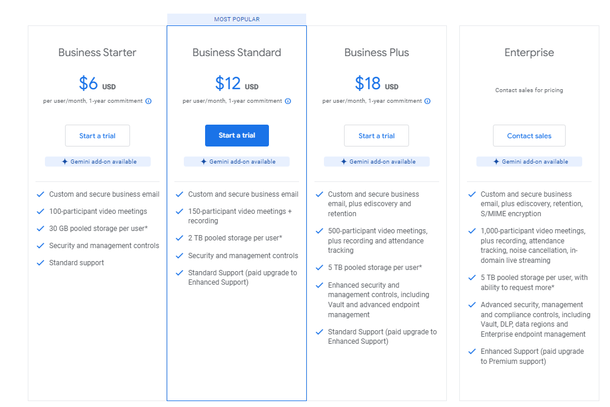
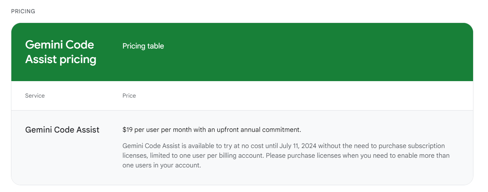

## **Google Gemini** ##
***

Google Gemini is a family of AI models. they can understand and generate text like a regular **Large Language Model (LLM)**, but they can also natively understand, operate on, and combine other kinds of information like images, audio, videos, and code.

### Features: ###
-	Multimodal reasoning analyses and comprehends technical documents that combine text, code, and diagrams.
-	Draft generation creates initial drafts of explanations, procedures, or comparisons based on your prompts.
-	Text editing and rewriting improves clarity, flow, and sentence structure in existing technical documents.
-	Style adaptation adjusts the tone and style of your writing to suit different audiences. 
-	Targeted search locates specific information within technical documents or code repositories.
-	Brainstorm ideas provides a list of relevant talking points to overcome writer's block and develop comprehensive technical content.
-	Summarize complex topics by making them easier to understand.
-	Identify relevant information pinpoints specific details within technical data.
-	Technical knowledge integration ensures the generated content is accurate.
-	Translation and language understanding.
-	Versatility in handling diverse tasks and inputs
-	Coding assistance for developers and programmers.
-	Multilingual support for interacting in multiple languages.
-	Integration with Google Services. 
-	Visual context analysis to understand and interpret visual content.
-	Variety of Ad Formats & Game Creation.

### Plan ###

We can use Google Gemini for free. But there are paid Google products that offer access to Gemini's functionalities:

