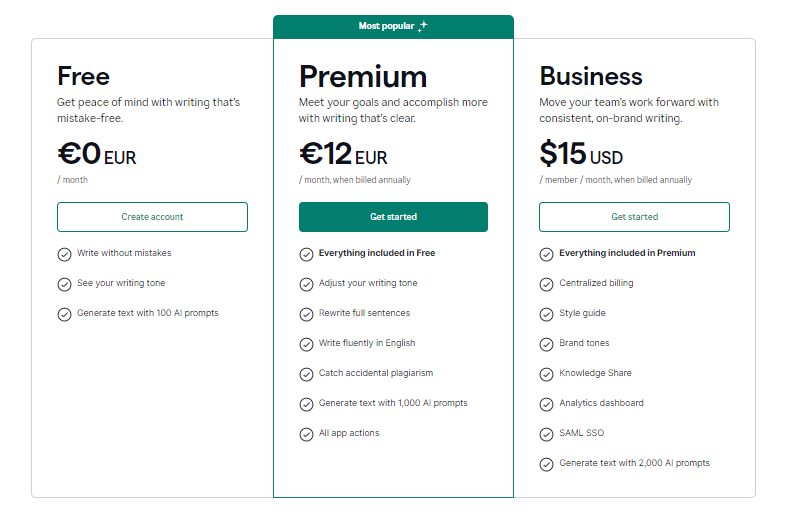

## **Grammarly** ##

Grammarly is a leading writing assistant that aids users in improving their grammar, spelling, and writing style. 
Grammarly was founded in 2009 by Alex Shevchenko, Max Lytvyn, and Dmytro Lider. It was built through a combination of linguistic expertise, advanced artificial intelligence, Natural Language Processing (NLP), and machine learning technologies.

### Features:
-	Grammar and spelling correction for accurate and error-free writing.
-	Advanced writing suggestions to enhance clarity, coherence, and style.
-	Vocabulary enhancement for enriching language and expression.
-	Plagiarism checker to ensure originality and proper citation.
-	Real-time suggestions and corrections for immediate feedback while writing.
-	Integration with various platforms, including web browsers, desktop applications, and mobile devices.
-	Access to additional resources for further learning and improvement.
-	Tone detector for analyzing and adjusting the tone of your writing.
-	Snippets feature for saving and reusing frequently used text fragments.
-	Style guide to maintain consistency and adherence to preferred writing styles.
-	Creation of custom style rules to align with specific writing preferences or guidelines.
-	Organization-wide dialect preference settings for standardizing language use within a company or group.
-	Brand tone customization to reflect brand identity and voice in written communication.
-	Citation generator for accurately citing sources and references.
-	Essay checker for comprehensive writing evaluation and improvement suggestions.
-	Analytics for tracking writing progress and identifying areas for improvement.
-	User-friendly interface for intuitive navigation and ease of use.

### Plans:###

Grammarly offers a variety of plans to suit different user requirements: 

1.	Free Plan:
- Provides basic writing assistance in areas such as grammar, spelling, and punctuation checks. Ideal for everyday use, especially for individuals who need help with writing simple, everyday documents.
2.	Premium Plan:
- Available at $12 per month (billed annually) or $30 per month (billed monthly). Offers advanced features like style and tone suggestions, enhanced grammar checks, vocabulary assistance, and writing style recommendations based on the specific genre of the content. This plan is best suited for professionals, students, and anyone looking to elevate their writing quality.
3.	Business Plan:
- Priced at $15 per user per month (billed annually). Designed for teams and organizations, it includes all Premium features along with additional admin tools, centralized billing, usage reports, a dashboard, and priority support. This plan promotes professionalism in communication and is suitable for entire teams.
