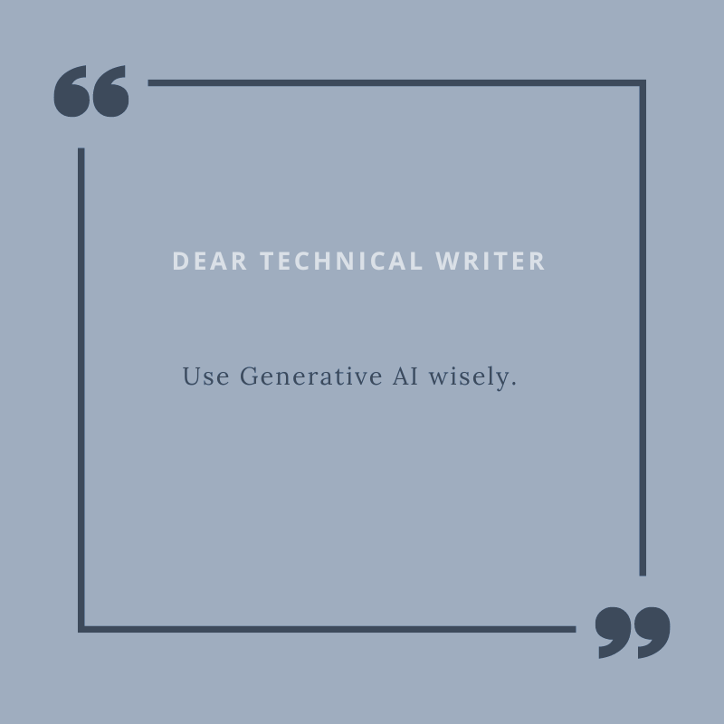

# **How do they combine?** #
***

The development of Generative AI in recent years has significantly impacted not only the market but also the way people work. 

According to a [Salesforce survey](https://www.salesforce.com/news/stories/generative-ai-ethics-survey/), as many as 61 percent of white-collar workers have already used or plan to use artificial intelligence for their tasks. Many see the potential that this tool holds. At the same time, there are increasing discussions about the risks associated with using GenAI. 

Technology is a tool intended to serve people and improve their operations, so GenAI could also substantially affect the work of technical writers. Technical writers generally work close to technology, and adding another tool to their toolkit can help them achieve a level of productivity that might not be attainable otherwise. 

Technical writers are valued not only for their specialized knowledge but also for creating content that is accessible to the audience. GenAI can support them in many areas, such as creating creative content. However, only a specialist can oversee the accuracy of the results provided by GenAI. 

Technical writers who are comfortable with GenAI's Large Language Models will become professionals with AI expertise. This is expected to enhance respect for the technical writers' role in product creation, as they will master both the technologies a well as the art of effective communication.

The job of technical writers is to create accurate and complete documentation, and tools based on generative artificial intelligence can provide significant support. However, this requires acquiring the skills to use them consciously and responsibly. To achieve that, one must understand both the capabilities and limitations these tools entail. These aspects will be presented and discussed in the following chapters.

