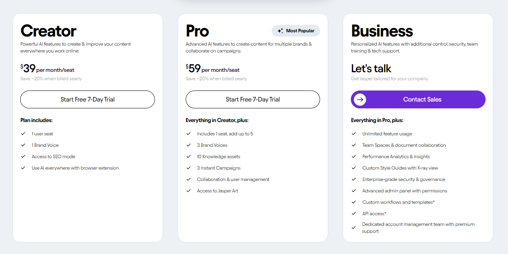

## **Jasper AI** #

Jasper AI has evolved into a universal writing aid that leverages AI for text creation. It's not just a copywriting assistant but a unique AI solution designed to enhance writing. Built on Artificial Intelligence, particularly machine learning and **Natural Language Processing**, Jasper AI assists writers by overcoming writer’s block, organizing workflow, checking for plagiarism, and optimizing content for the target audience. Compatible with Google Docs, Microsoft Word, and other web applications, it also allows users to track research notes and generate personalized responses for ads and reviews. With over a hundred thousand users, Jasper.ai is rapidly becoming one of the most popular writings tools.

### Features: ###

-	Content Generation such as blog posts, articles, website copy, and even books with Jasper's assistance.
-	Refine existing content by improving its clarity, conciseness, and overall quality.
-	Grammar and spelling correction for accurate and error-free writing.
-	Generate compelling marketing copy for landing pages, product descriptions, and sales emails.
-	SEO optimization - optimize your content for search engines to enhance its visibility and organic traffic.
-	Marketing campaign ideas, brainstorming and develop innovative marketing campaign ideas.
-	Generate catchy taglines and slogans for your brand or products.
-	Storytelling assistance develop engaging storylines and plot points for your creative writing projects.
-	Generate creative writing prompts and ideas to overcome writer's block.
-	Voice commands for hands-free operation.
-	Multilingual support for interacting in multiple languages.
-	Customizable Templates.
-	Integration with Other Tools.
-	Built-in Chrome Extension.
-	Plagiarism checker to ensure originality and proper citation.

### Plan ###

Jasper AI offers a variety of plans to suit different user requirements:

1.	**Creator Plan**:
-	Available at $39/month/seat (-20% annually).  Essential AI features, SEO mode, and browser extension for content improvement.
2.	**Pro Plan**:
-	Available at $59/month/seat (-20% annually). Includes all features in Creator, plus collaboration tools and advanced insights.
3.	**Business Plan**: 
- Provides personalized AI features for enhanced control, security, and team training, unlimited feature usage, team collaboration, and advanced analytics,  Custom Style Guides, enterprise-grade security, and dedicated support.
