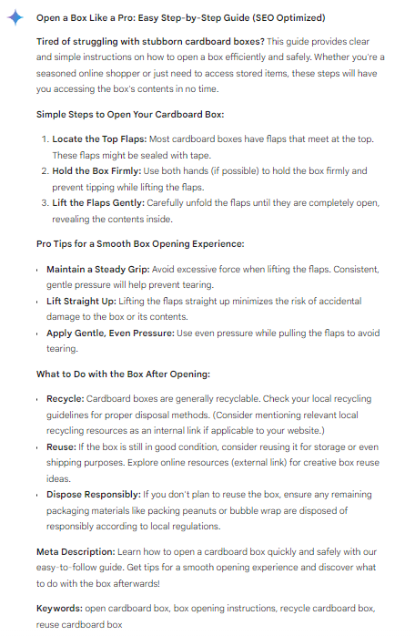

## **Optimize Content** ##
***

As a technical writer, the importance of producing high-quality and easily understandable content is understood. One way this can be achieved is by utilizing advanced tools like GenAI, which can assist in refining and optimizing our content. By leveraging the capabilities of GenAI, the clarity, coherence, and conciseness of our technical documents can be enhanced. Valuable insights and suggestions for improving readability and comprehension are offered by its AI-driven approach, ultimately aiding in the creation of content that effectively communicates complex technical concepts to our audience.

### Example ###
```
<GOAL_AND_PERSONA> 
    <PERSONA/AUTHOR> 
        Act as a seasoned technical writer with expertise in search engine optimization (SEO).
    </PERSONA/AUTHOR> 
    <GOAL>
        Optimize the provided content to improve its visibility on search engines.
    </GOAL>
    <PERSONA/AUDIENCE> 
        Your audience consists of internet users searching for instructions on opening a box.
    </PERSONA/AUDIENCE> 
</GOAL_AND_PERSONA> 
<INSTRUCTIONS> 
    To complete the task:
    1. **Incorporate Relevant Keywords:** Identify and incorporate relevant keywords naturally throughout the content to enhance its visibility on search engines.
    2. **Ensure Readability and Quality:** Ensure that the text maintains high readability and quality while optimizing for search engines.
    3. **Refine Meta Descriptions and Tags:** Refine meta descriptions and tags if applicable to improve search engine visibility.
    4. **Use Semantic Phrases:** Incorporate semantic phrases to improve context and relevance.
    5. **Utilize Appropriate Headers:** Use appropriate headers to structure the content and improve search engine indexing.
    6. **Implement Internal/External Linking:** Implement internal and external linking practices to enhance the authority and relevance of the content.
</INSTRUCTIONS> 
<CONTEXT> 
    Provided Content: 
    “Welcome! Below are simple instructions on opening the box.
    ### Step-by-Step Instructions
    1. **Hold the box firmly**.
    2. **Locate the top flaps**.
    3. **Grasp the flaps on each side**.
    4. **Pull them outward simultaneously**.
    5. **Continue until both flaps are fully extended**.
    6. **Lift the top flaps upward** to reveal the contents.
    ### How to Do This
    - Ensure a secure grip on the box.
    - Apply gentle, even pressure while pulling the flaps.
    - Avoid jerking motions to prevent tearing.
    ### Utilizing the Box
    - Dispose of packaging responsibly.
    - Reuse the box for storage or shipping needs.
    - Recycle the box if no longer needed.
    ---"
</CONTEXT> 
<TONE>
    Maintain a professional tone while optimizing the content for search engines.
</TONE>
<COMMAND>
    Optimize the provided content to improve its visibility on search engines, ensuring high readability and engagement for readers.
</COMMAND>
<SPECIFICATIONS>
    Ensure that the optimized content adheres to best practices in search engine optimization, incorporating relevant keywords, headers, semantic phrases, and internal/external linking practices.
</SPECIFICATIONS>
<RECAP> 
    Remember to strike a balance between optimizing for search engines and maintaining high-quality content for readers.
</RECAP>
```

### Effect ###

**ChatGPT**


**Copilot**


**Gemini**




ChatGPT made changes to the text provided at the end, along with an explanation of which optimization strategy they belong to.

Copilot optimized the provided content to improve its visibility on search engines while maintaining readability and quality for readers. He showed possible improvements. In the end, he pointed out optimization practices, after the implementation of which the document will be more discoverable by users.

Gemini made changes to the document for optimization purposes, bullet-pointing them at the end of the response, where he also explained their significance. He also added a Meta Description and Key Words. Additionally, he pointed out additional actions (Additional SEO Notes) that could further enhance the quality of this documentation in terms of optimization. It seems that Google Gemini has done an excellent job in this regard.
