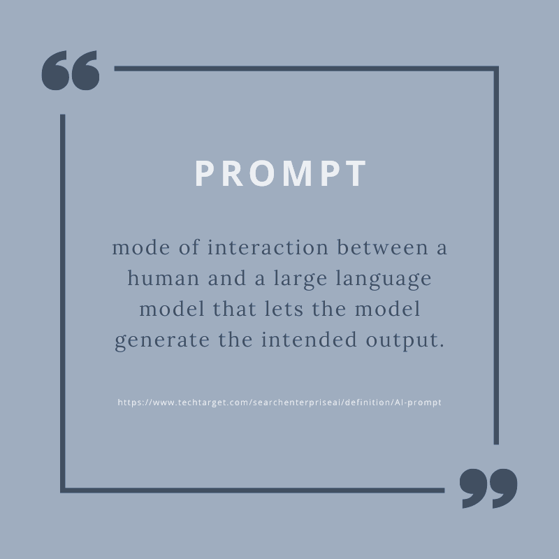

# **Prompt Design Strategies** #
***

The term **Prompt** is essential for understanding the interaction between humans and language models in AI. It refers to a natural language request given to a model to trigger a response. Prompts may include questions, directives, contextual information, few-shot examples, or incomplete inputs needing continuation. The model's output can range from text and embeddings to code, images, videos, music, and more, based on its specific functions. This paragraph examines the concept of prompts, detailing their various forms and the expansive possibilities they offer in artificial intelligence.

Prompts are gaining significant prominence in AI. An interview prompt - the method of interacting with a **Large Language Model (LLM)** - requires a thoughtful approach. By providing explicit instructions, AI prompts enable a model to produce the intended results. This process involves leveraging **Natural Language Processing (NLP)** and **Deep Learning (DL)** algorithms to interpret the user's input.