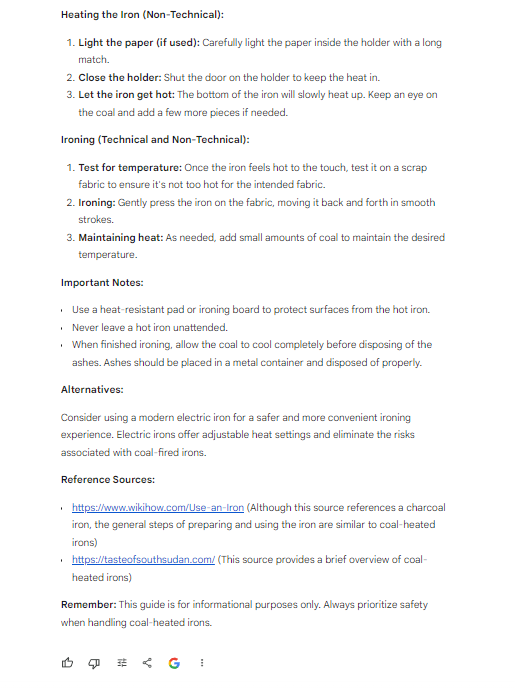

## **Research & Fact-Check** ##
***

Accurate data and facts are essential for maintaining the integrity of a technical document. To get the best results from GenAI, begin with clear and precise prompts. Use an iterative process to refine the responses, asking follow-up questions for more detailed or specific information. Always document the sources of information and data obtained through GenAI, and attribute information correctly to maintain transparency and credibility. Finally, review the information provided by GenAI for accuracy and relevance, using your expertise to interpret and integrate the data appropriately into your writing. This approach will ensure that all information you use is thoroughly fact-checked.

### Example ###

```
<GOAL_AND_PERSONA> 
[PERSONA/AUTHOR] 
you are experienced technical writer in writing user manuals
[GOAL]
Your main goal is to Write Documentation on Coal Heated Iron.
[PERSONA/AUDIENCE] 
You are writing for both technical and non-technical readers. Write 
</GOAL_AND_PERSONA> 
<INSTRUCTIONS> 
To complete the task:
1.	Examine, Validate, and Verify Technical Aspects: Thoroughly review all technical aspects related to using coal heated iron. Ensure accuracy and correctness.
2. Craft Precise and Transparent Documentation: Create documentation that offers clear and concise instructions suitable for both technical and non-technical readers. The information provided should be easily understandable.
3. Validate Details Using Credible Sources: Confirm the accuracy of all details by referencing reliable sources. Ensure that the information presented is trustworthy and backed by credible references.
4. Maintain Consistency: Uphold consistency in terminology and formatting throughout the documentation. This ensures clarity and coherence in the instructions provided.
5. Ensure Content Alignment with Current Standards: Verify that the content complies with the latest standards and practices in using coal heated iron. Keep the information up-to-date and relevant.
 </INSTRUCTIONS> 
<CONTEXT> 
Write about coal heated iron.
</CONTEXT> 
<TONE>
use a formal and informative tone. 
</TONE>
```

### Effect ###

**ChatGPT**


**Copilot**


**Gemini**




GenAI models can be useful for technical writers in researching and fact-checking, especially if they have access to a wide range of information and sources. However, a problem may arise with completely new technologies that the model has not been trained on before. In such situations, manual adjustments or additions to the documentation may be necessary to ensure its accuracy and completeness. In these cases, the knowledge and experience of a human editor may still be necessary.