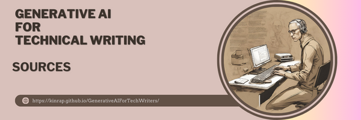

# **Sources** #
	***

1.	<a href="https://getgenie.ai/challenges-and-limitations-of-ai-content-writing-tools/#" target="_blank">10 Challenges and Limitations of Ai Content Writing Tools</a>
2.	<a href="https://www.forbes.com/sites/theyec/2023/05/30/14-benefits-and-drawbacks-of-using-ai-tools-to-write-business-content/?sh=2ff79c147177" target="_blank">14 Benefits And Drawbacks Of Using AI Tools To Write Business Content</a> 
3.	<a href="https://medium.com/@tinrovic/new-chatgpt-4o-features-that-you-didnt-know-about-2b0323fe7d95" target="_blank">30 New ChatGPT-4o Features That You Didn’t Know About</a>
4.	<a href="https://snappify.com/blog/ai-tools-for-technical-writing" target="_blank">7 Best Tools for Technical Writing with AI Features (2023)</a>
5.	<a href="https://www.zdnet.com/article/a-thorny-question-who-owns-code-images-and-narratives-generated-by-ai/#google_vignette" target="_blank">A thorny question: Who owns code, images, and narratives generated by AI?</a>
6.	<a href="https://www.sheaws.com/ai-technical-writing-is-it-a-good-idea/" target="_blank">AI & Technical Writing: Is It a Good Idea?</a>
7.	<a href="https://blog.bit.ai/ai-for-technical-writing/" target="_blank">AI For Technical Writing: Use Cases & Best Tools!</a>
8.	<a href="https://www.techtarget.com/searchenterpriseai/definition/AI-prompt" target="_blank">AI prompt</a>
9.	<a href="https://clickup.com/ai/prompts-for-technical-writing" target="_blank">AI Prompts For Technical Writing</a>
10.	<a href="https://www.lakera.ai/blog/risks-of-ai" target="_blank">AI Risks: Exploring the Critical Challenges of Artificial Intelligence</a> 
11.	<a href="https://metaprompting.de/en/ai/will-ai-replace-technical-writers/" target="_blank">Ai vs technical writers: will artificial intelligence replace human expertise in technical writing?</a>
12.	<a href="https://aicontentfy.com/en/blog/ai-writing-vs-traditional-writing-pros-and-cons" target="_blank">AI Writing vs Traditional Writing: Pros and Cons</a>
13.	<a href="https://www.mckinsey.com/capabilities/quantumblack/our-insights/an-executives-guide-to-ai" target="_blank">An executive’s guide to AI</a>
14.	<a href="https://aiindex.stanford.edu/wp-content/uploads/2023/04/HAI_AI-Index-Report_2023.pdf" target="_blank">Artificial Intelligence Index Report 2024</a>
15.	<a href="http://dln.jaipuria.ac.in:8080/jspui/bitstream/123456789/14268/1/MGI-artificial-intelligence-discussion-paper.pdf" target="_blank">ARTIFICIAL INTELLIGENCE THE NEXT DIGITAL FRONTIER?</a>
16.	<a href="https://www.mckinsey.com/capabilities/risk-and-resilience/our-insights/as-gen-ai-advances-regulators-and-risk-functions-rush-to-keep-pace" target="_blank">As gen AI advances, regulators—and risk functions—rush to keep pace</a>
17.	<a href="https://ucddublin.pressbooks.pub/StudentResourcev1_od/chapter/best-practices-for-prompt-engineering/" target="_blank">Best practices for prompt engineering</a> 
18.	<a href="https://contentlab.com/can-ai-write-technical-content/" target="_blank">Can AI writing be used to create technical content?</a>
19.	<a href="https://www.linkedin.com/pulse/chatgpt-technical-writing-how-tech-writers-can-leverage-martin-u--6zhbf/" target="_blank">ChatGPT For Technical Writing: How Tech Writers Can Leverage On ChatGPT For Improved Productivity</a>
20.	<a href="https://medium.com/softserve-technical-communication/chatgpt-in-technical-writing-risks-and-dangers-51503964a773" target="_blank">ChatGPT in Technical Writing: Risks and dangers</a>
21.	<a href="https://jenni.ai/chat-gpt/errors-limitations?seg_acam=21034416380&utm_campaign=21034416380&utm_source=x&utm_medium=cpc&utm_content=&utm_term=&ad_id=&gad_source=1&gclid=Cj0KCQjw0ruyBhDuARIsANSZ3wp_uwLUi7fSdSNshrPZpsfOIT5yzk9lUboJTtpd7N_MkkMxfeEhMVgaArnXEALw_wcB" target="_blank">ChatGPT Limitations: What You Need to Know Before Diving In</a> 
22.	<a href="https://beingtechnicalwriter.com/chatgt-prompts/" target="_blank">ChatGPT Prompts for Technical Writers - Boost Your Productivity and Creativity</a> 
23.	<a href="https://clickup.com/templates/ai-prompts/technical-writing?utm_source=google-pmax&utm_medium=cpc&utm_campaign=gpm_cpc_ar_nnc_pro_trial_all-devices_tcpa_lp_x_all-departments_x_pmax&utm_content=&utm_creative=_____&gad_source=1&gclid=Cj0KCQjwmMayBhDuARIsAM9HM8dcV0DujsCtV9kfBCGS-5K9j9JbuO_CboZ5kSRihk3Hxw7kUskxc_4aAuwJEALw_wcB" target="_blank">ChatGPT Prompts For Technical Writing</a> 
24.	<a href="https://promptadvance.club/chatgpt-prompts/writing/technical-writing" target="_blank">ChatGPT Prompts for Technical Writing</a>
25.	<a href="https://www.sipotra.it/wp-content/uploads/2019/05/Confronting-the-risks-of-artificial-intelligence.pdf" target="_blank">Confronting the risks of artificial intelligence</a>
26.	<a href="https://research.aimultiple.com/data-annotation/" target="_blank">Data Annotation in 2024: Why it matters & Top 8 Best Practices</a>
27.	<a href="https://www.crowdstrike.com/cybersecurity-101/cyberattacks/data-poisoning/" target="_blank">DATA POISONING:THE EXPLOITATION OF GENERATIVE AI</a>
28.	<a href="https://www.scmagazine.com/perspective/data-privacy-and-security-in-genai-enabled-services" target="_blank">Data privacy and security in  GenAI-enabled services</a>
29.	<a href="https://medium.com/@DigitalQuill.ai/deep-inside-to-google-gemini-whats-key-features-and-why-we-use-ai-gpt-a6576b2e5024" target="_blank">Deep Inside to Google Gemini : What’s Key Features and Why we Use?</a>
30.	<a href="https://judy.hashnode.dev/effect-of-ai-on-technical-writing#heading-chatgpt" target="_blank">Effect of AI on Technical Writing</a>
31.	<a href="https://oxoinnovation.com/generative-ai-vs-human-translators/" target="_blank">Embracing AI in Localization: Bridging Tech and Human Expertise</a>
32.	<a href="https://michael-shan.medium.com/embracing-the-future-how-ai-is-revolutionizing-technical-writing-9962104f6674" target="_blank">Embracing the Future: How AI is Revolutionizing Technical Writing</a>
33.	<a href="https://www.icaew.com/technical/technology/artificial-intelligence/generative-ai-guide/risks-and-limitations" target="_blank">ENERATIVE AI GUIDE Risks and limitations</a>
34.	<a href="https://www.mckinsey.com/capabilities/quantumblack/our-insights/exploring-opportunities-in-the-generative-ai-value-chain" target="_blank">Exploring opportunities in the generative AI value chain</a>
35.	<a href="https://skpipblog.pl/pl/fair-use-czyli-kiedy-w-swietle-prawa-amerykanskiego-mozemy-legalnie-korzystac-z-cudzej-tworczosci/" target="_blank">FAIR USE, czyli kiedy w świetle prawa amerykańskiego możemy legalnie korzystać z cudzej twórczości?</a>
36.	<a href="https://link.springer.com/chapter/10.1007/978-3-031-54252-7_5" target="_blank">GenAI Data Security</a>
37.	<a href="https://wrc.charlotte.edu/generative-ai-writing" target="_blank">Generative AI & writing</a>/
38.	<a href="https://www.banyansecurity.io/blog/future-technical-writing-generative-ai/" target="_blank">Generative AI and the Future of Technical Writing</a>
39.	<a href="https://www.slideshare.net/slideshow/generative-ai-for-technical-writer-or-information-developers/267265870" target="_blank">Generative AI for Technical Writer or Information Developers</a>
40.	<a href="https://www.slideshare.net/slideshow/generative-ai-for-technical-writer-or-information-developers/267265870" target="_blank">Generative AI for Technical Writer or Information Developers</a>
41.	<a href="https://www.inma.org/blogs/product-initiative/post.cfm/generative-ai-will-be-a-useful-assistant-in-the-process-of-storytelling" target="_blank">Generative AI will be a useful assistant in the process of storytelling</a>
42.	<a href="https://fact.technology/learn/generative-ai-advantages-limitations-and-challenges/" target="_blank">Generative AI: Advantages, Disadvantages, Limitations, and Challenges</a>
43.	<a href="https://www.ai-scaleup.com/articles/ai-tools/google-gemini-ai/" target="_blank">Google Gemini AI: Step-by-Step Guide to 9 Remarkable Features</a>
44.	<a href="https://gemini.google.com/" target="_blank">Google Gemini</a>
45.	<a href="https://workspace.google.com/" target="_blank">Google Workspace</a>
46.	<a href="https://www.tomsguide.com/ai/chatgpt/gpt-4o-what-features-you-can-use-right-now-and-whats-coming-soon" target="_blank">GPT-4o — what features you can use right now and what’s coming soon</a>
47.	<a href="https://www.linkedin.com/pulse/grammarly-free-vs-premium-2024-which-one-good-you-rahul-vishwakarma-r5ikc/" target="_blank">Grammarly Free vs Premium 2024: Which One is Good For You?</a>
48.	<a href="https://www.grammarly.com/" target="_blank">Grammarly</a>
49.	<a href="https://www.nature.com/articles/d41586-024-01543-1" target="_blank">Guidelines for academics aim to lessen ethical pitfalls in generative-AI use</a>
50.	<a href="https://medium.com/@zahwahjameel26/how-ai-is-rewriting-the-rulebook-for-technical-writers-f308d843d393" target="_blank">How AI is Rewriting the Rulebook for Technical Writers?</a>
51.	<a href="https://www.linkedin.com/advice/0/how-can-you-write-content-optimized-artificial-hk2of" target="_blank">How can you write content optimized for artificial</a> 
52.	<a href="https://essentialdata.com/how-does-ai-impact-technical-writing/" target="_blank">How Does AI Impact Technical Writing?</a>
53.	<a href="https://document360.com/blog/technical-writing-with-genai/" target="_blank">How GenAI Will Enhance a Technical Writer’s Capabilities</a>
54.	<a href="https://document360.com/blog/prompt-engineering-for-technical-writers/" target="_blank">How Technical Writers Can Master Prompt Engineering</a>
55.	<a href="https://www.linkedin.com/pulse/how-technical-writers-can-master-prompt-engineering-sheebha-austin/" target="_blank">How Technical Writers Can Master Prompt Engineering</a> 
56.	<a href="https://document360.com/blog/chatgpt-for-technical-writing/" target="_blank">How Technical Writers Can Utilize ChatGPT?</a> 
57.	<a href="https://www.techtarget.com/searchSecurity/tip/How-to-craft-a-generative-AI-security-policy-that-works" target="_blank">How to craft a generative AI security policy that works</a> 
58.	<a href="https://www.bloomreach.com/en/blog/2023/how-to-train-ai-for-your-business-best-practices" target="_blank">How To Train AI for Business: Best Practices and 3 Key Steps</a>
59.	<a href="https://3cloudsolutions.com/resources/how-to-train-generative-ai-using-company-data/" target="_blank">How to train generative ai using your company’s data</a>
60.	<a href="https://www.ibm.com/docs/en/watsonx/saa" target="_blank">IBM watsonx as a Services</a>
61.	<a href="https://blog.google/technology/ai/google-gemini-ai/#introducing-gemini" target="_blank">Introducing Gemini: our largest and most capable AI model</a>
62.	<a href="https://cloud.google.com/vertex-ai/generative-ai/docs/learn/prompts/introduction-prompt-design" target="_blank">Introduction to prompting</a>
63.	<a href="https://www.lakera.ai/blog/training-data-poisoning" target="_blank">Introduction to Training Data Poisoning: A Beginner’s Guide</a>
64.	<a href="https://www.jasper.ai/" target="_blank">Jasper.ai</a>
65.	<a href="https://soco.com.au/know-it-all-chatgpt-and-its-key-capabilities-that-will-surprise-your-team/" target="_blank">Know it all: ChatGPT and its key capabilities</a>
66.	<a href="https://soco.com.au/know-it-all-chatgpt-and-its-key-capabilities-that-will-surprise-your-team/" target="_blank">Know it all: ChatGPT and its key capabilities</a>
67.	<a href="https://www.dxheroes.io/blog/lets-talk-about-ai-2-the-top-5-ai-tools-for-technical-writers" target="_blank">Let's talk about AI: #2 The Top 5 AI Tools for Technical Writers</a> 
68.	<a href="https://milenajoanna.github.io/FinalProjectVistulaLLM-sForBeginners/" target="_blank">LLM-s For Beginners</a> 
69.	<a href="https://hbr.org/2023/06/managing-the-risks-of-generative-ai" target="_blank">Managing the Risks of Generative AI</a>
70.	<a href="https://www.microsoft.com/en-us/microsoft-copilot" target="_blank">MIcrisift Copilot</a> 
71.	<a href="https://www.reddit.com/r/ChatGPTPromptGenius/comments/16w58cq/op_prompts_for_technical_writers/?rdt=39468" target="_blank">OP prompts for technical writers</a>
72.	<a href="https://www.springboard.com/blog/data-science/machine-learning-gpt-3-open-ai/" target="_blank">OpenAI GPT-3: Everything You Need to Know</a>
73.	<a href="https://roadmap.sh/prompt-engineering/prompts/parts-of-a-prompt" target="_blank">Parts of a Prompt</a>
74.	<a href="https://www.ndu.edu/Privacy/PII-Breach-Reporting/" target="_blank">PII Breach Reporting</a>
75.	<a href="https://machinelearningmastery.com/prompt-engineering-for-effective-interaction-with-chatgpt/" target="_blank">Prompt Engineering for Effective Interaction with ChatGPT</a>
76.	<a href="https://www.nightfall.ai/ai-security-101/prompt-injection" target="_blank">Prompt Injection</a>
77.	<a href="https://wordhero.co/blog/pros-and-cons-of-ai-writing-tools" target="_blank">Pros and Cons of AI Writing Tools</a>
78.	<a href="https://www.elegantthemes.com/blog/business/writesonic" target="_blank">Review 2024: The Best AI-Powered Writing Tool?</a> 
79.	<a href="https://aws.amazon.com/blogs/security/securing-generative-ai-an-introduction-to-the-generative-ai-security-scoping-matrix/" target="_blank">Securing generative AI: An introduction to the Generative AI Security Scoping Matrix</a>
80.	<a href="https://www.weforum.org/agenda/2024/04/stanford-university-ai-index-report/" target="_blank">Stanford just released its annual AI Index report. Here's what it reveals</a>
81.	<a href="https://devloper-hs.medium.com/supercharge-your-prompt-with-these-tips-a-prompt-engineering-guide-18713b530412" target="_blank">Supercharge your prompt with these tips! — A Prompt Engineering Guide</a>
82.	<a href="https://leonfurze.com/2024/02/19/teaching-ai-writing-ideas/" target="_blank">Teaching AI Writing: Ideas</a>
83.	<a href="https://www.linkedin.com/pulse/technical-writing-ai-ways-use-assistant-write-content-dauda-lawal/" target="_blank">Technical Writing with AI: Ways to Use AI Writing Assistant to Write Technical Content</a>
84.	<a href="https://medium.com/softserve-technical-communication/technical-writing-complement-or-compete-with-generative-ai-6403ee30c22b" target="_blank">Technical Writing: Complement or compete with Generative AI?</a>
85.	<a href="https://openai.com/policies/" target="_blank">OpenAI Terms & Policies</a>
86.	<a href="https://www.harvardonline.harvard.edu/blog/benefits-limitations-generative-ai" target="_blank">The Benefits and Limitations of Generative AI: Harvard Experts Answer Your Questions</a>
87.	<a href="https://zapier.com/blog/best-ai-productivity-tools" target="_blank">The best AI productivity tools in 2024</a>/
88.	<a href="https://www.linkedin.com/pulse/dark-side-ai-technical-writing-samir-senapati/" target="_blank">The Dark Side of AI in Technical Writing</a>
89.	<a href="https://www.zdnet.com/article/how-we-can-harness-the-power-of-generative-ai-ethically/" target="_blank">The ethics of generative AI: How we can harness this powerful technology</a>
90.	<a href="https://www.toolify.ai/ai-news/the-impact-of-ai-on-technical-writing-limitations-challenges-and-future-2243809" target="_blank">The Impact of AI on Technical Writing: Limitations, Challenges, and Future</a>
91.	<a href="https://medium.com/@soravideoai2024/the-intersection-of-ai-and-technical-writing-2460df4ec88d" target="_blank">The Intersection of AI and Technical Writing</a>
92.	<a href="https://www.thezenagency.com/latest/the-pros-and-cons-of-using-ai-as-a-writing-tool/" target="_blank">The Pros and Cons of Using AI as a Writing Tool</a> 
93.	<a href="https://medium.com/@chasegison/the-revolution-of-ai-in-technical-writing-and-documentation-4e66ab1dc03a" target="_blank">The Revolution of AI in Technical Writing and Documentation</a>
94.	<a href="https://www.elsevier.com/about/policies-and-standards/the-use-of-generative-ai-and-ai-assisted-technologies-in-writing-for-elsevier" target="_blank">The use of generative AI and AI-assisted technologies in writing for Elsevier</a>
95.	<a href="https://seowind.io/tone-of-voice-examples-ai/" target="_blank">Tone of Voice Examples. With AI prompts & Content Sample</a>
96.	<a href="https://intellipaat.com/blog/top-artificial-intelligence-tools/" target="_blank">Top 30 Artificial Intelligence (AI) Tools List</a>
97.	<a href="https://research.aimultiple.com/ai-challenges/" target="_blank">Top 7 AI Challenges & Solutions in 2024</a>
98.	<a href="https://aipromptsbank.com/best-chatgpt-prompts-for-technical-writing/" target="_blank">Top ChatGPT prompts for technical writing</a>
99.	<a href="https://aipromptsbank.com/best-chatgpt-prompts-for-technical-writing/" target="_blank">Top ChatGPT prompts for technical writing</a> 
100.	<a href="https://martinfowler.com/articles/2023-chatgpt-tech-writing.html" target="_blank">Using ChatGPT as a technical writing assistant</a> 
101.	<a href="https://lsa.umich.edu/sweetland/instructors/guides-to-teaching-writing/genai-in-the-writing-process.html" target="_blank">Using Generative AI or Chatbots in the Writing Process</a>
102.	<a href="https://lsa.umich.edu/sweetland/instructors/guides-to-teaching-writing/genai-in-the-writing-process.html" target="_blank">Using Generative AI or Chatbots in the Writing Process</a> 
103.	<a href="https://www.quora.com/What-are-the-limitations-or-challenges-of-using-AI-in-content-writing" target="_blank">What are the limitations or challenges of using AI in content writing?</a>
104.	<a href="https://www.linkedin.com/advice/0/what-risks-limitations-your-machine-learning-solution" target="_blank">What are the risks and limitations of your Machine Learning solution?</a>
105.	<a href="ttps://www.mckinsey.com/featured-insights/mckinsey-explainers/what-is-ai" target="_blank">What is AI (artificial intelligence)?</a>h
106.	<a href="https://www.oracle.com/sa/artificial-intelligence/ai-model-training/" target="_blank">What Is AI Model Training & Why Is It Important?</a>
107.	<a href="https://servicecenter.fsu.edu/s/article/What-is-AI-prompting" target="_blank">What is AI prompting?</a>
108.	<a href="https://www.pcmag.com/explainers/what-is-microsoft-copilot" target="_blank">What Is Copilot? Microsoft's AI Assistant Explained</a>
109.	<a href="https://www.mckinsey.com/featured-insights/mckinsey-explainers/what-is-generative-ai" target="_blank">What is generative AI? McKinsey&Company</a>
110.	<a href="https://www.nvidia.com/en-us/glossary/generative-ai/" target="_blank">What is Generative AI? Nvidia </a>
111.	<a href="https://zapier.com/blog/google-gemini/?utm_source=google&utm_medium=cpc&utm_campaign=gaw-row-nua-evr-search_nb_desktop_blog_prospecting_developing1_developing2-ads&utm_term=&utm_content=1011539&utm_ads_campaign_id=19622168382&utm_ads_adset_id=157760468828&utm_ads_ad_id=659058345731&gad_source=1&gclid=Cj0KCQjw0ruyBhDuARIsANSZ3woeKa_7qD2P7Q2yZz_UZ-BDBLn_1xKCZjJyebGwo8C-Jbnc16rO5tEaAoggEALw_wcB" target="_blank">What is Google Gemini?</a>
112.	<a href="https://aws.amazon.com/what-is/prompt-engineering/" target="_blank">What is prompt engineering?</a>
113.	<a href="https://www.zdnet.com/article/who-owns-the-code-if-chatgpts-ai-helps-write-your-app-does-it-still-belong-to-you/" target="_blank">Who owns the code? If ChatGPT's AI helps write your app, does it still belong to you?</a>
114.	<a href="https://ai.google.dev/gemini-api/docs/prompting-intro?hl=pl" target="_blank">Wprowadzenie do projektowania promptów</a>
115.	<a href="https://www.scripted.com/writesonic-review-features-pricing-benefits" target="_blank">Writesonic Review: Features, Pricing, Benefits, and More</a> 
116.	<a href="https://clickup.com/blog/writesonic-vs-chatgpt/" target="_blank">Writesonic vs. ChatGPT: Which AI Writing Tool Is Best?</a>
117.	<a href="https://writesonic.com/" target="_blank">Writesonic</a>
118.	<a href="https://nano.komputronik.pl/n/wyszukiwarka-google-ai-overviews-gemini/" target="_blank">Wyszukiwarka Google przejdzie rewolucję. Co to jest AI Overviews?</a>
119.	Rewired: The McKinsey Guide to Outcompeting in the Age of Digital and AI, E.Lamarre, K. Smaje, R. Zemmel, Wiley 2023
