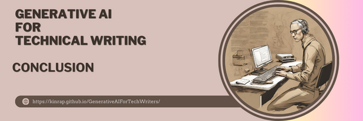

## **To use or not to use** ##
***

As a technical writer, the thought of incorporating generative AI into my work fills me with excitement and curiosity. The idea of using advanced technology to enhance my writing process and create high-quality content is incredibly appealing. With GenAI, I could easily generate accurate and detailed technical documentation, user manuals, and product descriptions, saving me valuable time and effort.

One of the main advantages of using GenAI as a technical writer is the ability to automate repetitive tasks. Writing technical content often involves explaining complex concepts and processes in a clear and concise manner. With the help of generative AI, I could streamline this process by using pre-trained models that have been trained on vast amounts of technical data. This would allow me to generate accurate and comprehensive content quickly, without having to spend hours researching and writing from scratch.

Furthermore, GenAI can also assist in ensuring consistency throughout my writing. Technical documentation often requires adherence to specific style guides and industry standards. By utilizing GenAI, I can ensure that my content follows these guidelines consistently, reducing the chances of errors or inconsistencies. This would not only save me time but also enhance the overall quality of my work.

Another exciting aspect of using generative AI is the potential for creativity and innovation. With GenAI models capable of generating text based on specific prompts or criteria, I can explore new ideas and approaches to my writing. This can help me think outside the box and come up with fresh and engaging content for my readers. By leveraging the power of GenAI, I can push the boundaries of what is possible in technical writing and deliver content that is both informative and captivating.

However, it is important to acknowledge that there are potential drawbacks to using GenAI in technical writing. As an AI model generates content, there is always a risk of inaccuracies or errors. It is crucial for technical writers to carefully review and edit the generated text to ensure its accuracy and reliability. Additionally, while generative AI can assist in generating content quickly, it should not replace the expertise and knowledge of a human technical writer. The human touch is still necessary to provide context, understand the target audience, and tailor the content accordingly.

The use of GenAI in technical writing holds immense potential for improving efficiency, consistency, and creativity. While there are challenges to overcome and careful consideration is required, the incorporation of AI technology can revolutionize the way technical writers work. By embracing generative AI, we can enhance our ability to deliver high-quality technical content that meets the needs and expectations of our readers.
