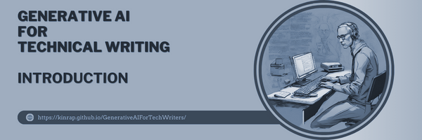
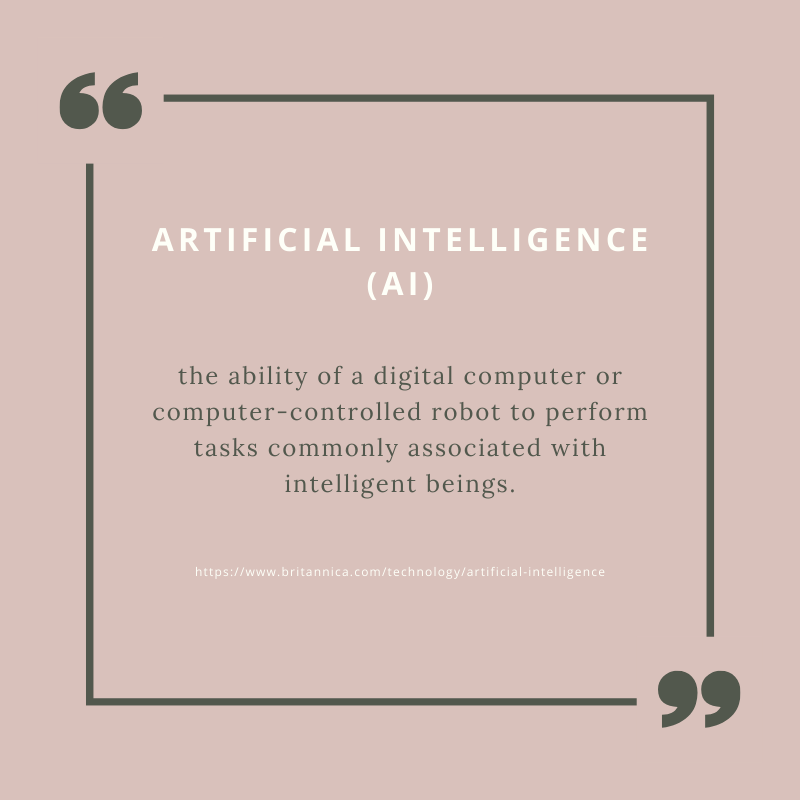
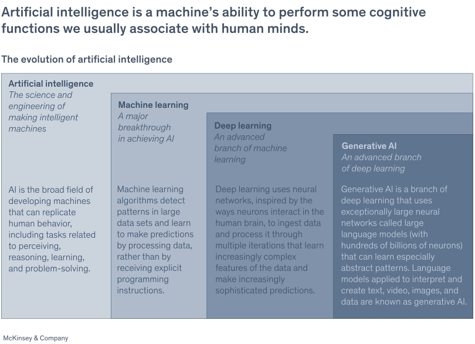
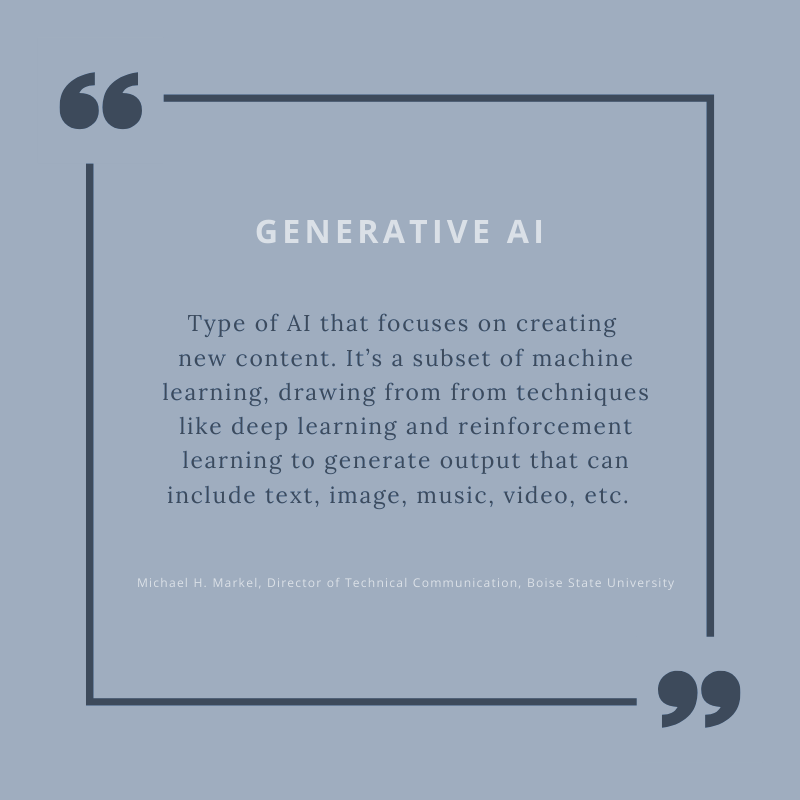

# **What is AI?** #
***

**Artificial Intelligence (AI)** refers to technology that simulates human intelligence in machines, enabling them to think and act in ways similar to humans. This includes developing algorithms and computer programs that can perform tasks generally associated with human intelligence, like visual perception, speech recognition, decision-making, and language translation.

## Intelligence
***

Before diving into the definition of artificial intelligence we need to understand the meaning of Intelligence. 

> **Intelligence** refers to the capacity to learn and apply knowledge. Knowledge, in turn, is the information obtained from experience. 

> **Experience** is the understanding derived from direct exposure or training.

Intelligence is composed of:  
- Reasoning;
- Learning;
- Problem-Solving;
- Perception;
- Linguistic Intelligence. 

Artificial intelligence (AI) empowers machines to learn from experience, adapt to various inputs, and carry out tasks typically associated with human abilities. The most common AI examples seen today heavily utilize deep learning and natural language processing. By leveraging these techniques, computers can be trained to complete specific tasks through the analysis of large volumes of data and the identification of underlying patterns.

##  Types of AI
***

### There are three main types of generative technologies: 
1.	**Digital twins** - are digital representations of real-world objects or systems, created using historical data, real-world data, synthetic data, or information from a system's feedback loop. They are constructed using software, data, and a combination of generative and non-generative models that replicate and synchronize with a physical system, whether that's a process, product, or entire system. Digital twins are valuable for testing, optimization, monitoring, or prediction. For instance, a digital twin of a company's supply chain can assist in predicting when shortages might occur.
2.	**A large language model (LLM)** - is a robust machine learning model designed to process and understand complex relationships in a natural language, generate text, and engage in conversations with users. These models are based on techniques such as deep learning and neural networks. As natural language-processing AI models, LLMs are trained on vast quantities of text data, resulting in models with billions of parameters. OpenAI's ChatGPT is a widely known example of a large language model.
3.	**Synthetic data generation** - is the process of creating data on demand, through self-service, or via automated algorithms and rules instead of gathering it from the real world. Synthetic data is typically generated to fill gaps where real data falls short. It replicates the same statistical properties, probabilities, patterns, and characteristics of real-world data on which it is based. Many organizations use synthetic data to maintain privacy or address other challenges associated with collecting and using real-world data, such as high costs, time-consuming data preparation, or inherent bias.

### Artificial intelligence (AI) can be classified into several types based on:
1. **Based on capabilities**:

    - **Narrow AI (Weak AI, ANI)** - This form of AI is built to accomplish a narrow task, like recognizing faces, conducting internet searches, or driving a vehicle. Examples: Siri, Alexa, autonomous vehicles, AlphaGo, and humanoid robots - Sophia.
    - **General AI (strong AI, AGI)** - A type of AI equipped with broad human-like cognitive skills, making it capable of autonomously addressing new and unfamiliar challenges.
    - **Superintelligent AI (ASI)** - This refers to a future form of AI in which machines could outperform human intelligence in all areas, including creativity, general wisdom, and complex problem-solving.

2. **Based on functionalities**:

    - **Reactive Machines** - These AI systems don't retain memories or past experiences for future reference. They process and respond to various situations in real time.
    - **Limited Memory** - These AI systems can make smarter and more accurate decisions by examining the past data they've accumulated. 
    - **Theory of Mind** - This is a more advanced form of AI that researchers are still developing. It involves understanding and remembering emotions, beliefs, and needs, then making decisions based on those factors. This kind of AI requires the machine to have a genuine understanding of human behavior.
    - **Self-aware AI** - This signifies the future of AI, where machines will possess their own consciousness, sentience, and self-awareness.

3. **Based on technologies**:

    - **Machine Learning (ML)** - AI systems that can self-improve through experience, without direct programming. They focus on building software that can learn autonomously by accessing and using data. 
    - **Deep Learning** - A subset of ML that encompasses multiple layers of neural networks.
    - **Natural Language Processing (NLP)** - This AI technology enables machines to understand and interpret human language. 
    - **Robotics** - AI field, centering on creating robots.
    - **Computer Vision** - This technology allows machines to interpret the world visually. 
    - **Expert Systems** - These AI systems respond to questions and tackle problems within a specific area of expertise using rule-based approaches.

## The Evolution of AI 
***

To understand how AI works, we should take a look at the evolution of artificial intelligence[^1]. 

**Artificial intelligence (AI)** involves making machines imitate human intelligence to carry out tasks. 

**Machine learning** is a branch of artificial intelligence. It focuses on building AI models that can "learn" from data patterns without human intervention. 

**Deep learning represents** a more sophisticated iteration of machine learning, excelling at handling diverse data sources such as text and unstructured data like images. It relies less on human intervention and frequently delivers more precise outcomes compared to conventional machine learning techniques. Operating on neural networks inspired by the interactions of neurons in the human brain, deep learning processes data through multiple layers of neurons, allowing it to discern increasingly intricate features within the data.

In this article, we aim to focus on what **Generative AI** is and whether, or rather how, it can be used in technical writing. 

## Generative AI
***

**Generative AI (Gen AI)** refers to an AI model that produces content based on a given prompt. It involves algorithms that can be employed to produce new content, including audio, code, images, text, simulations, and videos. While the full extent of Gen AI's potential is still being explored, there is some information already on how Gen AI models are built, what specific challenges they excel at addressing, and how they relate to other AI and machine learning technologies. 

Outputs from generative AI models can either closely resemble human-generated content, or come across as slightly strange to the human brain. The quality of these outputs is influenced by the model's sophistication and how well it matches the intended use case or input. Generative AI outputs are the result of precisely tuned combinations of data used to train the algorithms. Because these algorithms are trained on such a large volume of data, the outputs can give the impression of creativity. Moreover, these models often have random components, allowing them to generate multiple outputs from a single input, enhancing their life-like quality. 

Generative AI tools can generate a variety of credible writing within seconds, and adjust in response to criticism to better suit specific needs. This affects a wide range of industries in need of marketing content. Generative AI is used in industries such as banking, Insurance, life sciences, manufacturing, public sector, retail. Simply put, any business that has to produce clear written materials could find value in using generative AI. That's why Generative AI creates new opportunities for technical writers as well.

[^1] Souce: [What is AI (artificial intelligence)?](https://www.mckinsey.com/featured-insights/mckinsey-explainers/what-is-ai), Exhibit 1. 

