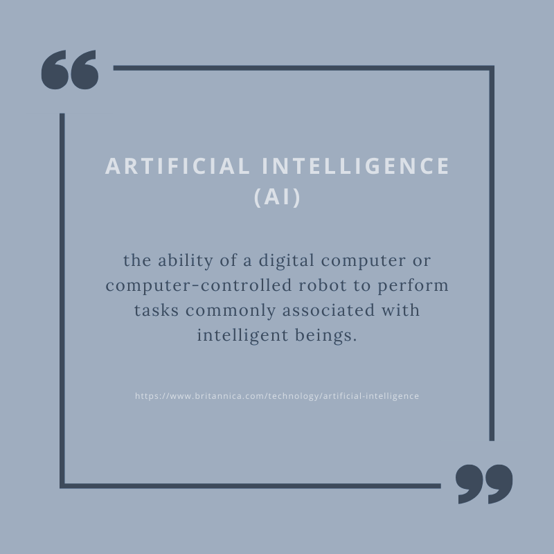
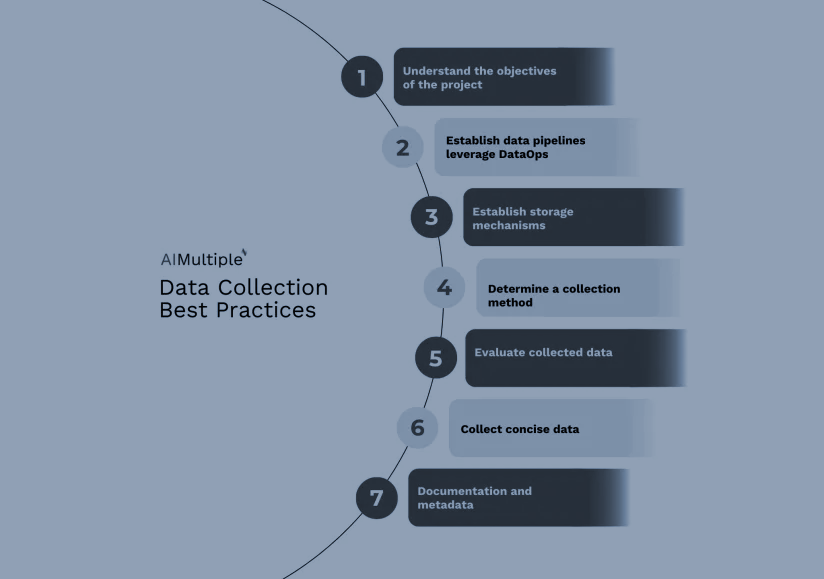

# **What is AI?** #
***

**Artificial Intelligence (AI)** refers to technology that simulates human intelligence in machines, enabling them to think and act in ways similar to humans. This includes developing algorithms and computer programs that can perform tasks generally associated with human intelligence, like visual perception, speech recognition, decision-making, and language translation.

## Intelligence
***

Before diving into the definition of artificial intelligence, we need to understand the meaning of Intelligence. 

> **Intelligence** refers to the capacity to learn and apply knowledge. Knowledge, in turn, is the information obtained from experience. 

> **Experience** is the understanding derived from direct exposure or training.

Intelligence is composed of:  
- Reasoning;
- Learning;
- Problem-Solving;
- Perception;
- Linguistic Intelligence. 

Artificial intelligence (AI) empowers machines to learn from experience, adapt to various inputs, and carry out tasks typically associated with human abilities. The most common AI examples seen today heavily utilize deep learning and natural language processing. By leveraging these techniques, computers can be trained to complete specific tasks through the analysis of large volumes of data and the identification of underlying patterns.

##  Types of AI
***

### There are three main types of generative technologies: 
1.	**Digital twins** - are digital representations of real-world objects or systems, created using historical data, real-world data, synthetic data, or information from a system's feedback loop. They are constructed using software, data, and a combination of generative and non-generative models that replicate and synchronize with a physical system, whether that's a process, product, or entire system. Digital twins are valuable for testing, optimization, monitoring, or prediction. For instance, a digital twin of a company's supply chain can assist in predicting when shortages might occur.
2.	**A large language model (LLM)** - is a robust machine learning model designed to process and understand complex relationships in a natural language, generate text, and engage in conversations with users. These models are based on techniques such as deep learning and neural networks. As natural language-processing AI models, LLMs are trained on vast quantities of text data, resulting in models with billions of parameters. OpenAI's ChatGPT is a widely known example of a large language model.
3.	**Synthetic data generation** - is the process of creating data on demand, through self-service, or via automated algorithms and rules instead of gathering it from the real world. Synthetic data is typically generated to fill gaps where real data falls short. It replicates the same statistical properties, probabilities, patterns, and characteristics of real-world data on which it is based. Many organizations use synthetic data to maintain privacy or address other challenges associated with collecting and using real-world data, such as high costs, time-consuming data preparation, or inherent bias.

### Artificial intelligence (AI) can be classified into several types based on:
1. **Based on capabilities**:

    - **Narrow AI (Weak AI, ANI)** - This form of AI is built to accomplish a narrow task, like recognizing faces, conducting internet searches, or driving a vehicle. Examples: Siri, Alexa, autonomous vehicles, AlphaGo, and humanoid robots - Sophia.
    - **General AI (strong AI, AGI)** - A type of AI equipped with broad human-like cognitive skills, making it capable of autonomously addressing new and unfamiliar challenges.
    - **Superintelligent AI (ASI)** - This refers to a future form of AI in which machines could outperform human intelligence in all areas, including creativity, general wisdom, and complex problem-solving.

2. **Based on functionalities**:

    - **Reactive Machines** - These AI systems don't retain memories or past experiences for future reference. They process and respond to various situations in real time.
    - **Limited Memory** - These AI systems can make smarter and more accurate decisions by examining the past data they've accumulated. 
    - **Theory of Mind** - This is a more advanced form of AI that researchers are still developing. It involves understanding and remembering emotions, beliefs, and needs, then making decisions based on those factors. This kind of AI requires the machine to have a genuine understanding of human behavior.
    - **Self-aware AI** - This signifies the future of AI, where machines will possess their own consciousness, sentience, and self-awareness.

3. **Based on technologies**:

    - **Machine Learning (ML)** - AI systems that can self-improve through experience, without direct programming. They focus on building software that can learn autonomously by accessing and using data. 
    - **Deep Learning** - A subset of ML that encompasses multiple layers of neural networks.
    - **Natural Language Processing (NLP)** - This AI technology enables machines to understand and interpret human language. 
    - **Robotics** - AI field, centering on creating robots.
    - **Computer Vision** - This technology allows machines to interpret the world visually. 
    - **Expert Systems** - These AI systems respond to questions and tackle problems within a specific area of expertise using rule-based approaches.

## The Evolution of AI 
***

To understand how AI works, we should take a look at the <a href="https://www.mckinsey.com/featured-insights/mckinsey-explainers/what-is-ai" target="_blank">evolution of artificial intelligence</a>. 

**Artificial intelligence (AI)** involves making machines imitate human intelligence to carry out tasks. 

**Machine learning** is a branch of artificial intelligence. It focuses on building AI models that can "learn" from data patterns without human intervention. 

**Deep learning represents** a more sophisticated iteration of machine learning, excelling at handling diverse data sources such as text and unstructured data like images. It relies less on human intervention and frequently delivers more precise outcomes compared to conventional machine learning techniques. Operating on neural networks inspired by the interactions of neurons in the human brain, deep learning processes data through multiple layers of neurons, allowing it to discern increasingly intricate features within the data.

In this article, we aim to focus on what **Generative AI** is and whether, or rather how, it can be used in technical writing. 

## Generative AI
***

**Generative AI (Gen AI)** refers to an AI model that produces content based on a given prompt. It involves algorithms that can be employed to produce new content, including audio, code, images, text, simulations, and videos. While the full extent of Gen AI's potential is still being explored, there is some information already on how Gen AI models are built, what specific challenges they excel at addressing, and how they relate to other AI and machine learning technologies. 

Outputs from generative AI models can either closely resemble human-generated content, or come across as slightly strange to the human brain. The quality of these outputs is influenced by the model's sophistication and how well it matches the intended use case or input. Generative AI outputs are the result of precisely tuned combinations of data used to train the algorithms. Because these algorithms are trained on such a large volume of data, the outputs can give the impression of creativity. Moreover, these models often have random components, allowing them to generate multiple outputs from a single input, enhancing their life-like quality. 

Generative AI tools can generate a variety of credible writing within seconds, and adjust in response to criticism to better suit specific needs. This affects a wide range of industries in need of marketing content. Generative AI is used in industries such as banking, insurance, life sciences, manufacturing, public sector, retail. Simply put, any business that has to produce clear written materials could find value in using generative AI. That's why Generative AI creates new opportunities for technical writers as well.

## **Training** ##
***

AI training is centered on teaching it to understand data correctly and learn from it to perform a specific task. Fundamentally, AI training mirrors the way humans gain knowledge through experience. 

Consider a child learning to identify various animals. By presenting the child with different examples, they gradually learn to distinguish between them. Similarly, an AI can be trained using numerous images of different animals to recognize their unique features. 

GenAI enables users to produce a variety of content types, including text, images, videos, sounds, and code, by entering different prompts. To generate such content, GenAI systems require substantial knowledge. Like a child needing numerous examples to recognize different animals, GenAi learns and is trained on documents and artifacts that already exist. For example, the OpenAI GPT-3 model has been trained with about 45 TB of text data from multiple sources - that’s about one million feet of bookshelf space

<a href="https://www.springboard.com/blog/data-science/machine-learning-gpt-3-open-ai/" target="_blank">Datasets used to train the model the OpenAI GPT-3 model</a>:

| Dataset      | Quantity (tokens) | Weight in training mix | Epochs elapsed when training for 300B tokens|
| -------------| ----------------- | ---------------------- | ------------------------------------------- |
| Common Crawl (filtered) | 410 billion | 60%               | 0.44                                        |
| WebText2     | 19 billion             | 22%	            | 2.9                                         |
| Books1       | 12 billion             | 8%                | 1.9                                         |
| Books2       | 55 billion	            | 8%                | 0.43                                        |
| Wikipedia    | 3 billion              | 3%                | 3.4                                         |

Initially, text-based machine learning models used supervised learning, where humans labelled data for the AI to learn from, such as classifying social media posts by sentiment. Now, models use self-supervised learning, processing extensive text data to predict sentence endings. This method powers accurate tools like ChatGPT. Generative AI evolves by training on increasingly larger data sets. It relies on AI models and algorithms trained on vast amounts of unlabeled data, requiring complex mathematics and significant computing power. These data sets enable the AI to predict outcomes similarly to how humans might act or create independently. Generative AI models employ neural networks to recognize patterns within available data, enabling the creation of fresh content. These models serve as the backbone for AI systems to execute various tasks. 

GenAI applications are aiding various business functions. However, one of the major hurdles in AI system development is the training of models. Proficiency in training AI models effectively is crucial. 

An AI model is a fusion of carefully selected algorithms and the training data used to refine them, enabling highly precise predictions. While some models may rely on just one algorithm, blurring the lines between the terms, the model itself emerges as the ultimate output post-training.

From a mathematical standpoint, an algorithm can be seen as an equation with unknown coefficients. The model materializes as chosen algorithms digest datasets to determine the most fitting coefficient values, thus crafting a predictive model. The term "AI model training" encompasses this process: feeding data to the algorithm, scrutinizing results, and fine-tuning model output to enhance accuracy and efficacy. This demands copious datasets capturing the entire spectrum of incoming data.

Algorithms must contend with outliers, surprises, inconsistencies, and initially puzzling patterns across all incoming datasets, repeatedly. This process forms the bedrock of learning—the capacity to discern patterns, grasp context, and make informed decisions. With sufficient AI model training, the amalgamation of algorithms within the model evolves into a mathematical predictor for various scenarios, incorporating allowances for unpredictability while maximizing predictability.

### Steps ### 

Training an AI model involves a series of steps, which may vary depending on the task and AI model type. General outline:
1.	**Define the Problem** - Clearly specify the task or problem the AI model should address, This could be anything from image classification to natural language processing.
2.	**Data Collection** - Gather a diverse dataset relevant to the problem. The quality and quantity of data significantly impact the model's performance.
3.	**Data Preprocessing** - Clean and preprocess the data to remove noise, handle missing values, and normalize it for effective training.
4.	**Choose a Model Architecture** - Select a suitable AI model architecture, like a convolutional neural network (CNN) for images or a recurrent neural network (RNN) for sequential data.
5.	**Model Training** - Use the pre-processed data to train the chosen AI model. During training, the model learns to make predictions by adjusting its parameters based on input data.
6.	**Evaluation** - Assess the model's performance using a separate dataset it hasn't seen before. Common evaluation metrics include accuracy, precision, recall, and F1-score.
7.	**Fine-tuning and Optimization** - Refine the model by adjusting hyperparameters and experimenting with different architectures and optimization techniques to enhance performance.
8.	**Deployment** -  Deploy the trained model into production for real-world applications, where it can make predictions or perform tasks.
9.	**Monitoring and Maintenance** - Continuously monitor the model's performance and periodically retrain it with new data to keep it accurate and up-to-date.

### Dataset Preparation and Data Preprocessing ###

Prior to training AI and machine learning algorithms, it is essential to collect and prepare data meticulously. This stage of model training seems the most significant to a technical writer. Without high-quality data, the performance of the machine and deep learning models will be compromised, hindering their ability to fulfill their intended functions. But remember that utilizing your company's data for AI training entails a dual responsibility of upholding stringent security measures and ethical guidelines. Safeguarding data against potential breaches necessitates the implementation of robust security protocols such as data encryption, access controls, and regular security audits. Ethically, it is imperative to utilize data in a manner that is fair, unbiased, and respects privacy rights. When leveraging company data, it is essential to adopt strategies that align with organizational goals while maintaining data security and ethical standards. 

The initial stage of data preparation entails the acquisition of authentic data. This phase encompasses the collection or creation of pertinent data and its subsequent preparation for training a machine learning model. To effectively train generative AI models using company data, it is crucial to commence with a thorough data audit and curation process. 

There are different data collection methods to leverage, depending on the scope of the project: 
- **Custom crowdsourcing** - entails distributing data gathering assignments to the broader public, offering guidance, and establishing a collaborative platform for data sharing.
- **Private collection or in-house data collection** - AI developers can gather data privately within the organization. 
- **Pre-cleaned and pre-packaged data sets** - this process utilizes pre-cleaned, pre-existing datasets that are accessible within the market.
- **Automated data collection** - this process is executed by employing data collection tools and software to autonomously gather data from online sources (web scraping, web crawling, API). 
- **Generative AI** – this process involves already existing data in LLMs. 
- **Reinforcement learning from human feedback (RLHF)** - this technique entails training a machine learning model, particularly in the context of reinforcement learning, by incorporating feedback from humans, rather than solely relying on traditional reward signals generated by the environment.

The selection of appropriate data collection methods holds significant importance in the realm of AI projects, directly shaping the accuracy, quality, and pertinence of the acquired data, consequently impacting the efficiency and effectiveness of the resultant AI solutions. Optimal data collection methods guarantee the precision of collected data. The quality of data plays a crucial role in the effectiveness of AI projects. Employing appropriate data collection tools and methodologies streamlines the data collection process, making it less time-intensive and more cost-efficient. Combining primary and secondary data collection methods alongside a blend of qualitative and quantitative data enables a more thorough analysis of the research question, fostering nuanced and robust AI solutions. 

Customizing the data collection approach to cater to the project's specific ensures the relevance of the collected data and the provision of targeted insights for the AI model.

<a href="https://research.aimultiple.com/data-collection-best-practices/" target="_blank"><b>Best practices</b></a>> 

 
 
Data gathered for training machine learning models can be disorderly and necessitates preprocessing and data modelling to be ready for training. Data processing involves improving and cleansing the data to enhance the overall quality and relevance of the entire dataset. Data modelling can aid in preparing datasets for training machine learning models by pinpointing the pertinent variables, relationships, and constraints that must be reflected in the data. This can guarantee that the dataset is comprehensive, precise, and suitable for the particular AI/machine learning issue being tackled. The next step is data annotation. This is the process of labeling data with relevant tags to make it easier for computers to understand and interpret. Annotation of data can be performed manually by humans or automatically using sophisticated machine learning algorithms and tools.

Data annotation play a critical role in supervised machine learning, as machine learning models require comprehension of input patterns to effectively process them and generate precise outcomes. Supervised machine learning models are trained and refined using accurately annotated data to tackle and resolve diverse problems such as classification and regression. 

### Model ### 
Choosing the correct model is a pivotal stage in machine learning training. This process entails selecting the optimal model architecture and algorithms to effectively address the problem at hand. 

The selection of the model is influenced by:
- The complexity of the task
- The characteristics and extent of the dataset
- The computational capacity accessible
- The desired level of precision

### Initial Training ### 

After collecting and annotating the data, the training process can commence by inputting the prepared data into the model to identify any potential errors. Throughout the initial training phase, data scientists should aim for outcomes within expected parameters while being attentive to potential algorithmic flaws. By training methodically without overextending, models can progress steadily and confidently. A recommended practice during the initial training phase is to mitigate overfitting. Overfitting arises when the model becomes overly biased and tailored to the training data. 

### Validations ###
After successfully navigating through the initial training phase, the model consistently produces expected results across essential criteria. The subsequent stage, training validation, is pivotal. Here, experts endeavor to thoroughly challenge the model to identify any issues, surprises, or shortcomings in the algorithm. This phase employs a distinct set of datasets from the initial phase, often with a broader scope and complexity than the training datasets.

### Testing ### 
Following validation using carefully selected and tailored datasets, the model can be put to the test with real-time data to assess its performance and accuracy. This stage involves utilizing datasets from real-world contexts, which represents a crucial step akin to removing training wheels, allowing the model to operate independently. If the model delivers accurate—and, notably, expected—results with the test data, it is deemed ready for deployment. However, should any deficiencies arise in the model's performance, the training process must be revisited until the model meets or surpasses performance benchmarks.

To learn more about LLM training visit <a href="https://milenajoanna.github.io/FinalProjectVistulaLLM-sForBeginners/docs/LLM_training.html" target="_blank">LLM_training</a>.

---

A well-trained GenAI can be an excellent tool for technical writers. It can serve as a valuable source of information and suggestions for further work. Therefore, appropriate training is crucial here.

---

