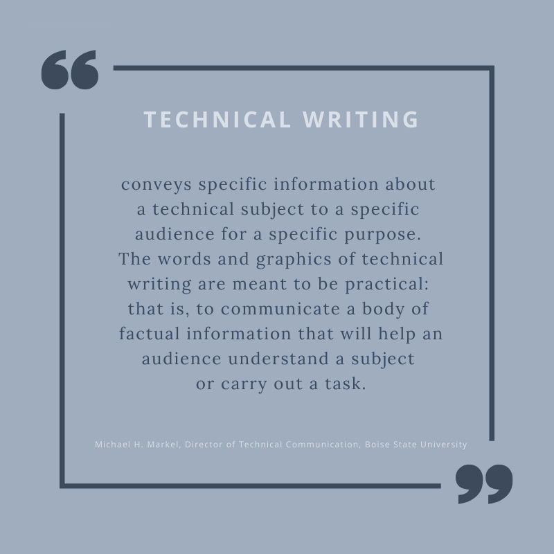

# **What is Technical Writing?**
***

**Technical writing** is a specialized form of writing that focuses on conveying complex information in a clear, concise, and understandable manner. It can be defined as *simplifying the complex*. Though this definition seems concise and simple, it encompasses a broad range of skills and attributes relevant to nearly every area of human activity. 

As a crucial subset of technical communication technical writing involves translating intricate information needed to carry out a task or meet a specific objective. Technical writing is the process of presenting complex information in a more accessible manner through reports, product descriptions, or instruction manuals.

 

The professionalization of technical writing and communication started around World War I when technological advancements in warfare, industry, and telecommunications became more prominent. The field of technical writing has transformed significantly within the last two decades, particularly in how technical information is gathered, created, and distributed. As a result, many organizations are adopting integrated technical communication systems to handle the flow of information more efficiently. These systems often involve a comprehensive content management strategy that includes technical documentation, marketing materials, internal communications, and other interactions with customers, suppliers, investors, and employees. 

The biggest part of technical communications is technical writing. Technical writers team up with editors, graphic designers, illustrators, document specialists, content managers, instructional designers, trainers, and analysts, to produce a diverse array of deliverables. While many people today associate technical writing with computer and software manuals, it spans any field or industry where complex information, processes, or instructions must be conveyed clearly. 

Effective technical writing delivers relevant, useful, and precise information designed for specific audiences, enabling them to perform certain actions toward a defined goal. This goal could be anything from operating industrial machinery, using software, avoiding accidents, safely consuming packaged food, diagnosing a medical condition, complying with regulations, coaching a sports team, to countless other activities. If a task requires specialized knowledge or skill, technical writing plays a crucial role.
