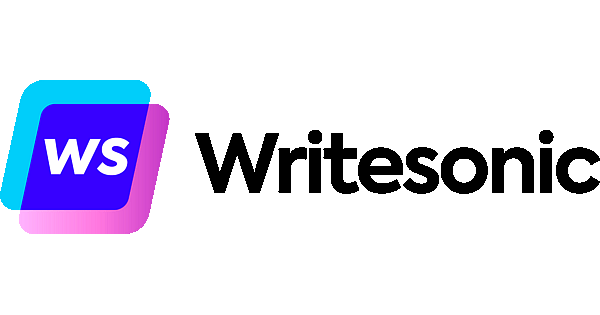
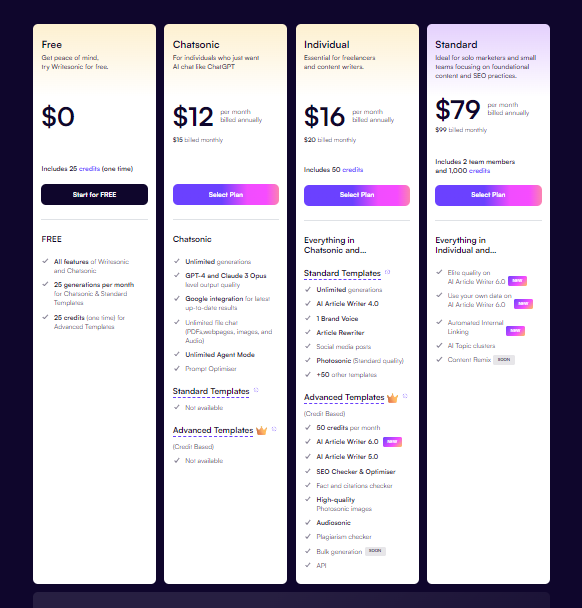

## **Writesonic** ##

Writesonic AI is a powerful tool for anyone involved in content creation, providing a blend of creativity, efficiency, and precision to enhance writing productivity. It is a versatile, AI-powered writing tool designed to assist with various content creation needs. Leveraging advanced Natural Language Processing (NLP) models. Writesonic enables users to generate high-quality written content quickly and efficiently.

### Features: ###

-	Generate long-form content like articles and blog posts with varying lengths (up to 1500+ words) based on your input.
-	Craft compelling descriptions for your products to enhance their appeal and conversion rates.
-	Develop story ideas and outlines to jumpstart your creative writing projects.
-	Expand on short snippets of content to create more comprehensive pieces.
-	Refine existing content to improve clarity, flow, and overall quality.
-	Rephrase existing text to convey the same message with different wording.
-	Condense lengthy articles into concise summaries for easier comprehension.
-	Create compelling bullet points that highlight your product or service's key features and benefits.
-	Generate short-form descriptions.
-	Brand Voice helps with Writesonic's AI training to write in your personal tone/style.
-	Customize the tone of the content to match the brand voice.
-	Convert written content into different AI voices for a more engaging presentation.
-	Multilingual Support to generate content for wider audience.
-	Chatsonic - interactive chatbot allows you to have a conversation with an AI persona to brainstorm ideas or generate creative text formats.
-	Self-Guided, Self-Learning AI Agents Trained on your Own Data.
-	Real-time SEO insights to optimize content, improve search rankings, and boost website traffic.
- Tools to create your own Chatbot

### Plan ###

Writesonic offers a variety of pricing plans tailored to different user requirements:

1.	**Free Plan**: 
-	Costs $0 per month and offers limited features like Chatsonic, Botsonic, and 100+ AI templates (limited).
2.	**Chatsonic**:
-	Available at $16 per month (billed annually) or $20 per month (billed monthly) with unlimited access to chatbot. 
3.	**Individual**: 
-	Available at $12 per month (billed annually) or $30 per month (billed monthly). It is dedicated for freelancers and content writers. This plan gives access to bunch of AI templates for generating blog posts, articles, product descriptions, and additional perks such as: Audiosonic, Plagiarism Checker, API access for seamless integration into your workflow.
4.	**Standard**: 
-	Available at $79 per month (billed annually) or $99 per month (billed monthly). Dedicated to for solo marketers and small teams focusing on foundational content and SEO practices. This plan gives acces Elite quality on AI Article Writer 6.0 which can be integrated with your own data into the AI Article Writer 6.0 for personalized results, and AI Content Gap Analyzer, 
5.	**Professional Plan**: 
-	Priced at $199 per month when billed annually (or $249 when billed monthly). It is dedicated to SEOs. This plan gives acces Elite quality on AI Article Writer 6.0 which can be integrated with your own data into the AI Article Writer 6.0 for personalized results. You can add 3 members of your team here.  
6.	**Advanced Plan**:
-	Priced at $399 per month when billed annually (or $499 when billed monthly). Dedicated to agencies and in-house marketing teams. Provides a Generative AI platform and offers advanced privacy and security features
7.	**Enterpise**:
-	Starts at $9,999 per year. provides a Generative AI platform and advanced privacy and security features. 