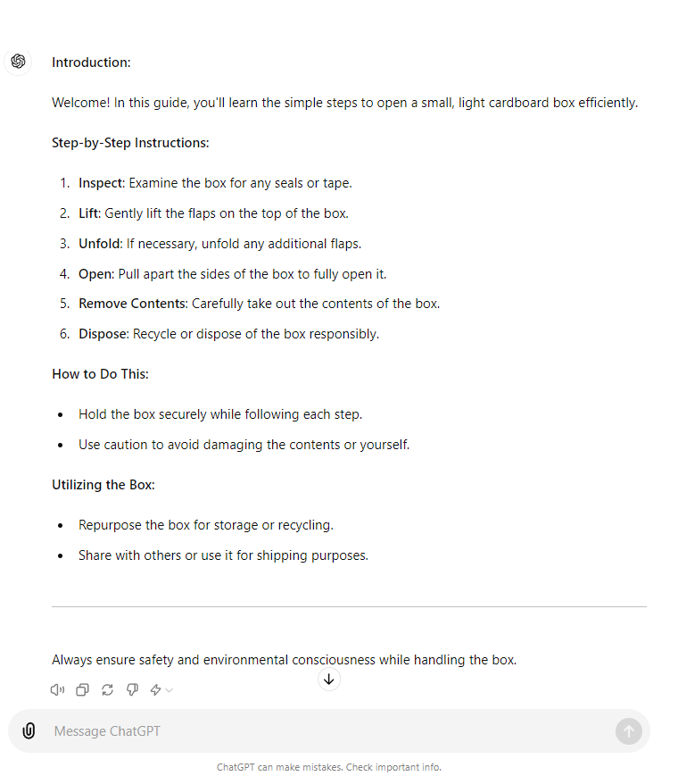
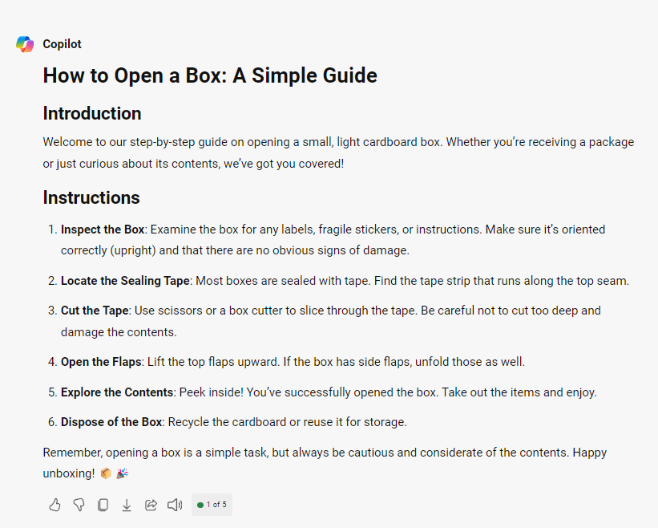
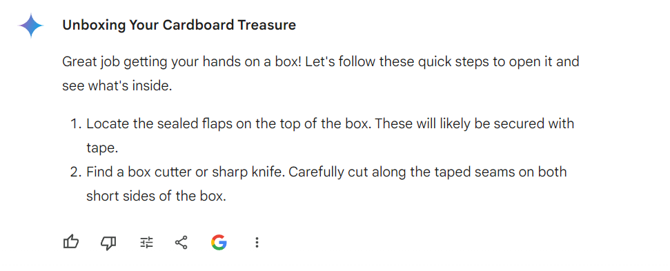
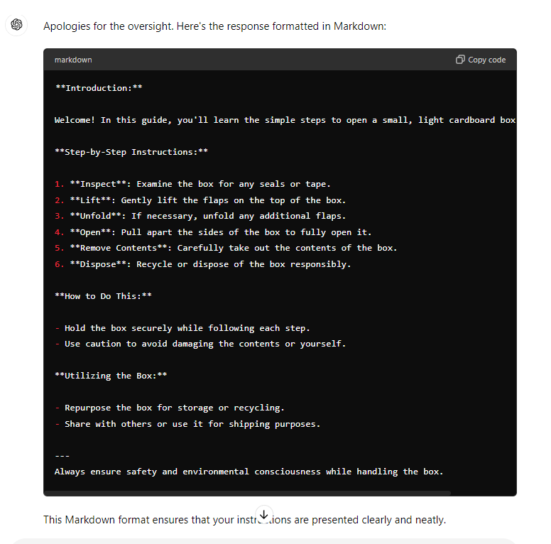
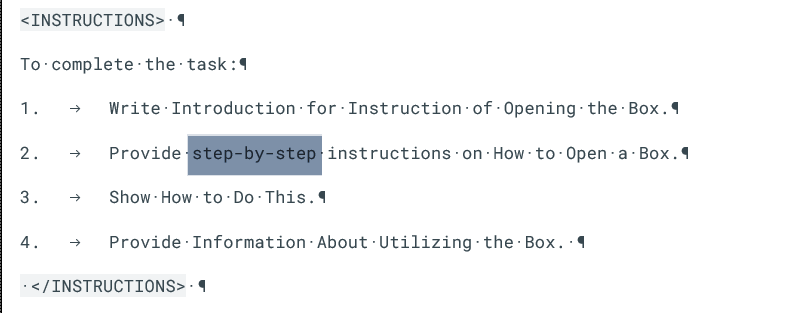
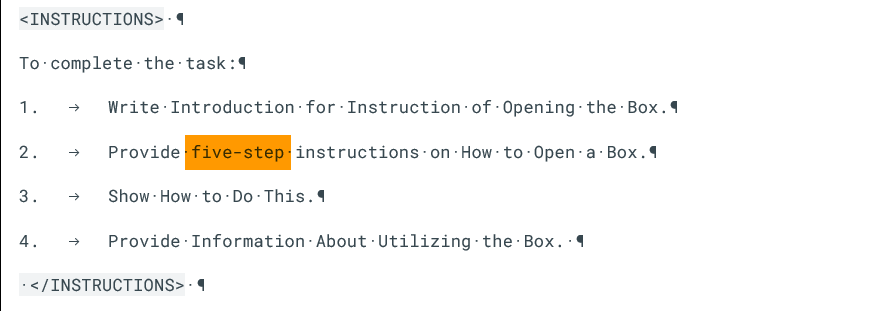
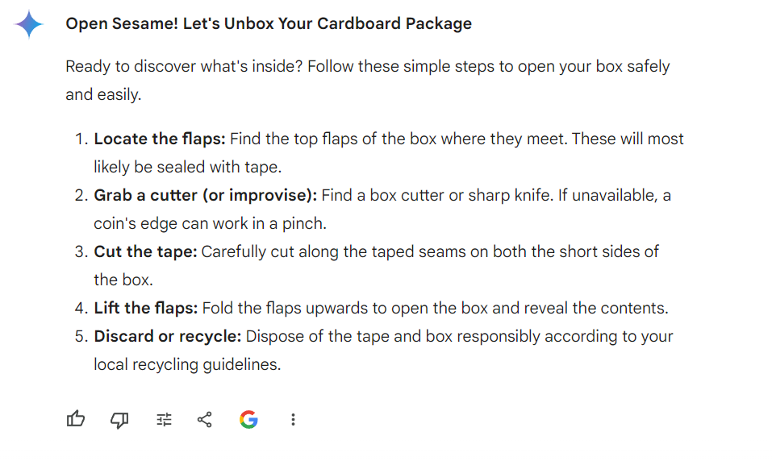

## **Writing Content - Instruction** ##
***

Let us start with a simple instruction, for which we wrote a prompt in the previous paragraph. Next, we will see what three publicly available tools will generate for us.

### Example ###

```
<GOAL_AND_PERSONA> 
[PERSONA/AUTHOR] 
You are a technical writer creating instructions.
[GOAL]
Your main goal is to provide clear instructions to people on how to open a box using direct commands. 
[PERSONA/AUDIENCE] 
Your audience consists of Americans aged 10 to 100 years.
</GOAL_AND_PERSONA> 
<INSTRUCTIONS> 
To complete the task:
1.	Write Introduction for Instruction of Opening the Box.
2.	Provide step-by-step instructions on How to Open a Box.
3.	Show How to Do This.
4.	Provide Information About Utilizing the Box. 
 </INSTRUCTIONS> 
<CONSTRAINTS> 
Don’t use more than two sentences in the introduction. 
</CONSTRAINTS> 
<CONTEXT> 
This is small, light, cardboard box. 
</CONTEXT> 
<TONE>
Use professional and understanding tone. 
</TONE>
<COMMAND>
Write clear instructions to people on how to open a box using direct commands.
</COMMAND>
<RESPONSE_FORMAT> 
Format your response in Markdown.
</RESPONSE_FORMAT> 
<EXAMPLES> 
I found six steps instruction of opening the box. 
<EXAMPLES> 
<SPECIFICATIONS>
Write instruction in the direct style using max. one hundred words.
</SPECIFICATIONS>
<RECAP> 
Always format your response in Markdown format.
</RECAP>
```

### Effect ###

ChatGpt



Copilot



Gemini



As we can see we don’t have markdown format in output. So, I add second prompt:
```
Output format: Markdown
```
ChatGPT was the only one to respond correctly to this prompt. Copilot and Gemini didn't provide any response, except for giving me a copy of the previous one.



Also, Gemini did not generate accurate output for the prompt. Why? Gemini ignored the example. When I changed the prompt instruction from step-by-step:



To five-zstep:



Gemini generated correct response:




As you can see, GenAI tools managed to generate the appropriate output despite being provided with all the content. They have already been trained to extent and possess knowledge on the subject. Imagine the possibilities that GenAI would have after proper training. Without training, if we wanted to obtain instructions for an unknown situation or tool, we would need to provide them with more specific data. However, it is always important to check the response generated by GenAI and rely on our human intuition.
