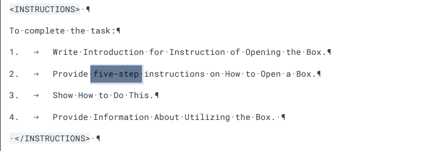

## **Writing Content - Instruction** ##
***

Let us start with a simple instruction, for which we wrote a prompt in the previous paragraph. Next, we will see what three publicly available tools will generate for us.

### Example ###

```
<GOAL_AND_PERSONA> 
    <PERSONA/AUTHOR> 
        You are a seasoned technical writer creating documentation.
    </PERSONA/AUTHOR> 
    <GOAL>
        Your main goal is to develop a logical flow for documentation on coal heated iron.
    </GOAL>
    <PERSONA/AUDIENCE> 
        Your audience consists of both technical and non-technical readers.
    </PERSONA/AUDIENCE> 
</GOAL_AND_PERSONA> 
<INSTRUCTIONS> 
    To complete the task:
    1. Write a clear introduction to the documentation on coal heated iron.
    2. Develop a structured flow starting with foundational aspects and gradually introducing advanced topics.
    3. Ensure smooth transitions between sections.
    4. Provide a clear conclusion summarizing the usage of coal heated iron.
</INSTRUCTIONS> 
<CONTEXT> 
    Consider the context of coal heated iron, including its applications and technical aspects.
</CONTEXT> 
<TONE>
    Maintain a professional and informative tone throughout the documentation.
</TONE>
<COMMAND>
    Develop a logical flow for documentation on coal heated iron that caters to both technical and non-technical readers.
</COMMAND>
<EXAMPLES> 
    Provide examples of structured documentation flows for similar technical topics.
</EXAMPLES> 


### Effect ###

**ChatGpt** 


**Copilot**


**Gemini**


As we can see we don’t have markdown format in output. So, I add second prompt:
```
Output format: Markdown
```
ChatGPT was the only one to respond correctly to this prompt. Copilot and Gemini didn't provide any response, except for giving me a copy of the previous one.


Also, Gemini did not generate accurate output for the prompt. Why? Gemini ignored the example. When I changed the prompt instruction from step-by-step:


To five-zstep:



Gemini generated correct response:


As you can see, GenAI tools managed to generate the appropriate output despite being provided with all the content. They have already been trained to extent and possess knowledge on the subject. Imagine the possibilities that GenAI would have after proper training. Without training, if we wanted to obtain instructions for an unknown situation or tool, we would need to provide them with more specific data. However, it is always important to check the response generated by GenAI and rely on our human intuition.
