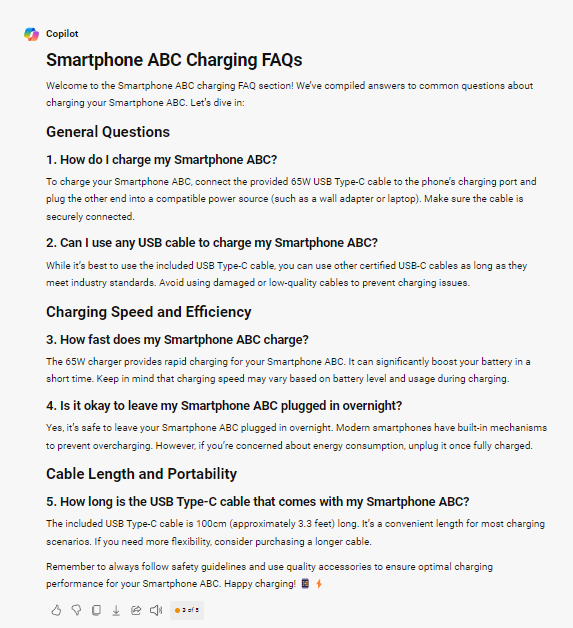

## **FAQ Section** ##
***

Frequently Asked Questions (FAQ) are a list of frequent questions and their corresponding answers related to a specific topic, product, service, or organization. The purpose of an FAQ section is to provide quick and accessible information to users, addressing typical concerns, issues, or inquiries they might have. This helps to reduce the need for direct customer support by offering readily available solutions and information. FAQ sections are often found on websites, in user manuals, or in other informational materials.

### Example ###
```
<GOAL_AND_PERSONA> 
[PERSONA/AUTHOR] 
You are seasoned technical writer with expertise in creating clear and concise content.
[GOAL]
Your task is to draft an FAQ section for charging smartphone ABC. 
[PERSONA/AUDIENCE] 
Your audience consists of Americans aged 10 to 100 years.
</GOAL_AND_PERSONA> 
<INSTRUCTIONS> 
To complete the task:
1.	The section should cover the most frequently asked questions and common concerns that users may have regarding the given topic.
2.	Each response should be presented in a clear and simple manner.
3.	Organize the questions into logical categories to facilitate easy navigation for readers.
4.	Verify that the content is precise, current, and adheres to industry standards and guidelines.
 </INSTRUCTIONS> 
<CONSTRAINTS> 
Don’t use technical language unless it is essential.
</CONSTRAINTS> 
<CONTEXT> 
Charger comes with a 65W USB Type-C cable that is 100cm long.
</CONTEXT> 
<TONE>
Use educational tone. 
</TONE>
<COMMAND>
Write 5 FAQs.
</COMMAND>
<RESPONSE_FORMAT> 
Format your response in Markdown.
</RESPONSE_FORMAT> 
<SPECIFICATIONS>
Use short clear sentences.
</SPECIFICATIONS>
```

### Effect ###

**ChatGPT**


**Copilot**



**Gemini**


As we can see, all three models provided similar responses. In this case, Gemini also managed to generate an answer close to the expected one. However, all three GenAI models did not respond in the expected format. After reminding them again about the output formatting, only ChatGPT gave the correct result.


