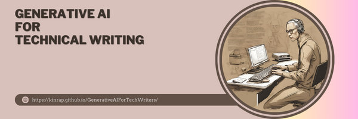

# **Generative AI for Technical Writing** 

Explore the impact of Generative AI on technical writing. Discover its potential in automating tasks and unlocking creativity. Join in navigating the challenges and ethical considerations of AI integration.

**Table of content**:
1. [Home](https://kinrap.github.io/GenerativeAIForTechWriters/)
2. [Introduction](https://kinrap.github.io/GenerativeAIForTechWriters/Docs/Introduction.html)
    - [What is Technical Writing?](https://kinrap.github.io/GenerativeAIForTechWriters/Docs/WhatIsTechnicalWriting.html) 
    - [What is AI](https://kinrap.github.io/GenerativeAIForTechWriters/Docs/WhatIsAI.html)
    - [How do they combine?](https://kinrap.github.io/GenerativeAIForTechWriters/Docs/HowDoTheyCombine.html)
3. [Capabilities](https://kinrap.github.io/GenerativeAIForTechWriters/Docs/Capabilities.html)
   - [Training](https://kinrap.github.io/GenerativeAIForTechWriters/Docs/Training.html)
   - [Generating ideas](https://kinrap.github.io/GenerativeAIForTechWriters/Docs/GeneratingIdeas.html)
   - [Content](https://kinrap.github.io/GenerativeAIForTechWriters/Docs/Content.html)
      - [Generation](https://kinrap.github.io/GenerativeAIForTechWriters/Docs/Generation.html)
      - [Optimization](https://kinrap.github.io/GenerativeAIForTechWriters/Docs/Optimalization.html)
      - [Translation and Localization](https://kinrap.github.io/GenerativeAIForTechWriters/Docs/Translation.html)
      - [Personalization](https://kinrap.github.io/GenerativeAIForTechWriters/Docs/Personalization.html)
   - [Assistant](https://kinrap.github.io/GenerativeAIForTechWriters/Docs/Assistant.html)
4. [Risks & Limitations](https://kinrap.github.io/GenerativeAIForTechWriters/Docs/Risk&Limitations.html)
    - [Quality](https://kinrap.github.io/GenerativeAIForTechWriters/Docs/Quality.html)
    - [Falsification](https://kinrap.github.io/GenerativeAIForTechWriters/Docs/Falsification.html)
    - [Data Privacy & Security](https://kinrap.github.io/GenerativeAIForTechWriters/Docs/DataPrivacy&Security.html)
    - [Lack of Creativity](https://kinrap.github.io/GenerativeAIForTechWriters/Docs/LackOfCreativity.html)
    - [Legal & Ethical Issues](https://kinrap.github.io/GenerativeAIForTechWriters/Docs/Legal&EthicalIssues.html)
    - [Training](https://kinrap.github.io/GenerativeAIForTechWriters/Docs/TrainingR&L.html)
    - [Human Oversight](https://kinrap.github.io/GenerativeAIForTechWriters/Docs/HumanOversight.html)
5. [Tools](https://kinrap.github.io/GenerativeAIForTechWriters/Docs/Tools.html)
   - [ChatGPT](https://kinrap.github.io/GenerativeAIForTechWriters/Docs/ChatGPT.html)
   - [Jasper AI](https://kinrap.github.io/GenerativeAIForTechWriters/Docs/JasperAI.html)
   - [Google Gemini](https://kinrap.github.io/GenerativeAIForTechWriters/Docs/GoogleGemini.html)
   - [Copilot](https://kinrap.github.io/GenerativeAIForTechWriters/Docs/Copilot.html)
   - [Writesonic AI](https://kinrap.github.io/GenerativeAIForTechWriters/Docs/Writesonic%20AI.html)
   - [Grammarly](https://kinrap.github.io/GenerativeAIForTechWriters/Docs/Grammarly.html)
6. [Prompt Design Strategies](https://kinrap.github.io/GenerativeAIForTechWriters/Docs/PromptDesignStrategies.html)
   - [Prompt Design and Prompt Engineering](https://kinrap.github.io/GenerativeAIForTechWriters/Docs/PromptDesign&Engineering.html)
   - [Benefits](https://kinrap.github.io/GenerativeAIForTechWriters/Docs/Benefits.html)
   - [Best Strategies](https://kinrap.github.io/GenerativeAIForTechWriters/Docs/BestSTrategies.html)
   - [Components of a prompt](https://kinrap.github.io/GenerativeAIForTechWriters/Docs/Components.html)
   - [Examples](https://kinrap.github.io/GenerativeAIForTechWriters/Docs/Examples.html)
      - [Writing Content - Instruction](https://kinrap.github.io/GenerativeAIForTechWriters/Docs/WritingInstruction.html)
      - [Introduction](https://kinrap.github.io/GenerativeAIForTechWriters/Docs/ExamplesIntroduction.html)
      - [FAQ Section](https://kinrap.github.io/GenerativeAIForTechWriters/Docs/faq.html)
      - [Research & Fact-Check](https://kinrap.github.io/GenerativeAIForTechWriters/Docs/Research.html)
      - [Create Logical Flow](https://kinrap.github.io/GenerativeAIForTechWriters/Docs/LogicalFlow.html)
      - [Get Feedback](https://kinrap.github.io/GenerativeAIForTechWriters/Docs/Feedback.html)
      - [Optimize Content](https://kinrap.github.io/GenerativeAIForTechWriters/Docs/OptimizeContent.html)
      - [Code Generation](https://kinrap.github.io/GenerativeAIForTechWriters/Docs/Code.html)
   - [Conclusion](https://kinrap.github.io/GenerativeAIForTechWriters/Docs/ConclusionPrompt.html)
7. [Conclusion](https://kinrap.github.io/GenerativeAIForTechWriters/Docs/Conclusion.html)
   - [To use or not to use](https://kinrap.github.io/GenerativeAIForTechWriters/Docs/ToUseOrNotToUse.html)
   - [Why doesn’t AI pose a risk to technical writers?](https://kinrap.github.io/GenerativeAIForTechWriters/Docs/WhyDoesn%E2%80%99tAIPoseARiskToTechnicalWriters.html)
8. [Sources](https://kinrap.github.io/GenerativeAIForTechWriters/Docs/Sources.html)
